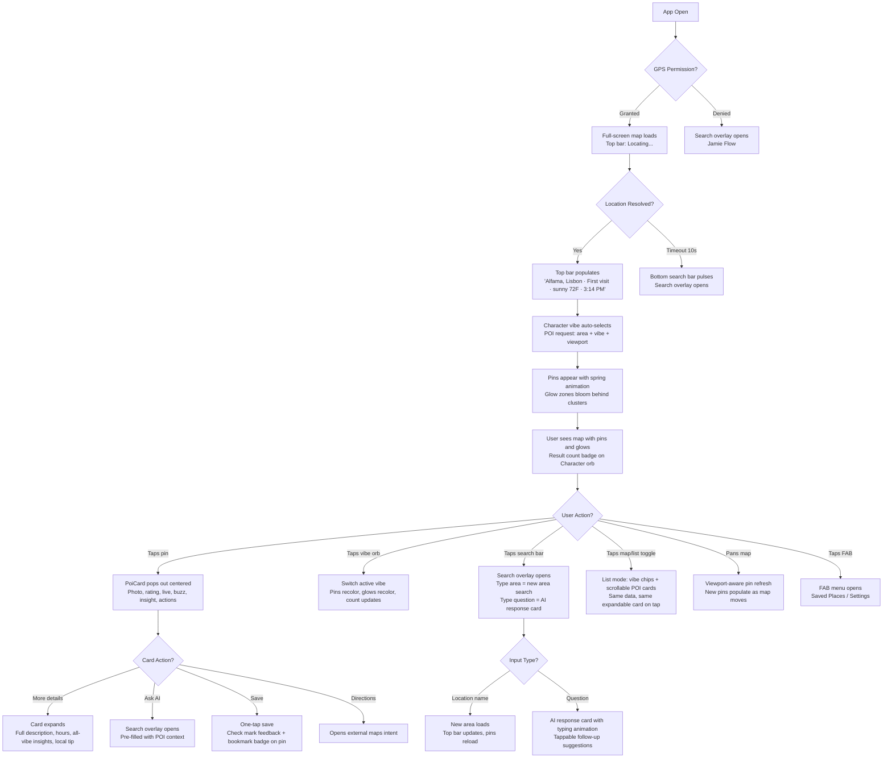
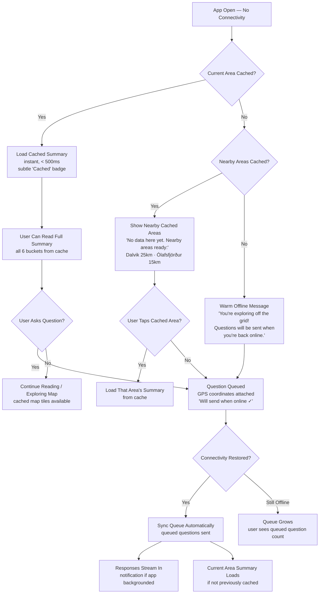

# UX Design Specification AreaDiscovery

**Author:** Asifchauhan
**Date:** 2026-03-03
**Last Revised:** 2026-03-06 (v3 prototype — full-screen map experience)

---

## Executive Summary

### Project Vision

AreaDiscovery is an AI-powered area exploration companion that proactively delivers holistic area portraits — organized into six knowledge buckets (Safety, Character, What's Happening, Cost, History, Nearby) — the moment a user arrives somewhere new. The core UX promise is the "whoa, I didn't know that" moment delivered within seconds, without the user searching for anything. Built with Kotlin Multiplatform (Android first), the app combines proactive AI briefings, conversational depth via text chat, and visual discovery via an interactive map with AI-generated POI markers.

### Target Users

| User Archetype | Profile | Core UX Need | Key Journey |
|---------------|---------|-------------|------------|
| **Asif** (primary) | Globally mobile explorer, 30s, multilingual | Instant area knowledge with local language context on arrival | First arrival in a new neighborhood |
| **Maya** (primary) | Hometown resident, 25, Chicago | Discover hidden stories in her own neighborhood | Home turf rediscovery |
| **The Garcias** (secondary) | Vacationing family of 4 | Kid-friendly hidden gems + safety while moving through a city | Family exploration with serendipity |
| **Jamie** (secondary) | Privacy-conscious first-time user | Full value without granting location permission | Location-denied → permission conversion |
| **Priya** (secondary) | Remote area explorer, rural Iceland | Reliable experience in connectivity dead zones | Offline-first with graceful degradation |

### Key Design Challenges

1. **Information density vs. overwhelm** — Six buckets of area content must feel like a gift, not a wall of text. Streaming UX must reveal content progressively, inviting exploration over scrolling fatigue.
2. **Map density vs. clarity** — Full-screen map with six vibes, glow zones, pins, and overlays must feel like discovery rather than visual chaos. Pin density, glow zone intensity, and label placement require careful balance.
3. **Graceful degradation across connectivity states** — Full connectivity, partial data, offline with cache, and offline without cache all need distinct but cohesive UX patterns. No empty screens, no error walls — always something useful.
4. **Permission-denied as first-class experience** — Manual search for location-denied users must prove value so compellingly that users grant permission afterward, not feel like a fallback.
5. **Multilingual content flow** — Local language terms embedded naturally within the user's preferred language without feeling like a translation feature.

### Design Opportunities

1. **Streaming as signature delight** — Token-by-token content rendering becomes a brand-defining interaction. Content materializing bucket-by-bucket creates anticipation — "watching the story unfold."
2. **Temporal UI adaptation** — Time-of-day and day-of-week context can influence not just content but visual tone, making the same screen feel fresh every visit.
3. **Shareable content cards** — Individual facts or bucket sections designed as beautifully formatted shareable cards drive organic growth — the content markets itself.

### Key Decisions from Multi-Agent Review + v3 Prototype Iteration

1. **Attention choreography** — The first 10 seconds must have a deliberate emotional arc: what draws the eye first, what reveals second, what invites exploration third.
2. **Map-first, always-on-screen (v3 redesign)** — The full-screen map is the hero experience. POI discovery is immediate and visual. The old summary-first architecture is retired; the map IS the primary surface. List mode is the first-class non-map alternative, toggled via top-right icons — not a fallback.
3. **Phase-layered UX** — Phase 1a must be complete and magical on its own. Phase 1b features layer on without breaking what already works.
4. **AI via search, not a dedicated screen** — AI conversation entry is embedded in the bottom search bar (detects questions vs location searches). No separate Chat screen — AI feels like smart search, always in context.
5. **No chrome, maximum map** — Bottom nav removed (FAB menu replaces it). Header removed (floating centered top bar). Bottom sheet for POIs removed (expandable pop-out card). Every decision removes UI chrome to expose more map.
6. **Vibe-filtered discovery** — The six vibe orbs on the right rail are the primary navigation. Selecting a vibe filters map pins and glow zones. Character auto-selects on load — no blank screen, immediate value.
7. **Emotional tone flexibility** — Different user journeys have different emotional entry points (curious, anxious, skeptical, casual, chaotic). UX tone must flex accordingly.

## Core User Experience

### Defining Experience

The core experience is **proactive area knowledge delivery**. Users open AreaDiscovery and within seconds receive a holistic portrait of their surroundings — history, safety, culture, cost, current events, and nearby points of interest — without typing a query or pressing a button. The app reads the user's location and streams a six-bucket area portrait directly to the screen.

The core loop: **Arrive → Open → See → Tap → Discover**

- **Arrive:** User enters a new area (or opens the app in any location)
- **Open:** App detects GPS location, full-screen map loads, Character vibe auto-selects
- **See:** POI pins appear on the map with vibe-colored glow zones highlighting clusters; top bar shows city, visit context, weather, time at a glance
- **Tap:** Single tap on any pin opens a rich expandable POI card (photo, rating, live status, AI insight, actions); tap a vibe orb to switch discovery lens
- **Discover:** Search bar doubles as AI — ask a question, get a contextual answer with follow-up suggestions; List mode provides full scrollable POI list as an alternate view

The interaction that must be absolutely flawless is the **first 5 seconds**: GPS lock → map loads → Character pins populate with glow zones visible. This is the "whoa, there's so much going on here" moment. If this fails, nothing else matters.

### Platform Strategy

| Dimension | Decision |
|-----------|----------|
| **Primary platform** | Android (Kotlin/Compose) — touch-first, one-handed mobile use |
| **Secondary platform** | iOS via KMP + Compose Multiplatform (post-Android stabilization) |
| **Input mode** | Touch (V1), Voice STT/TTS added V1.5 |
| **Orientation** | Portrait-only for V1 |
| **Connectivity** | Online-first with offline cache fallback (Phase 1b) |
| **Key device capabilities** | GPS/location services, network state, map rendering |
| **Target devices** | Android 8.0+ (API 26+), typical mid-range to flagship phones |

**Phase 1a screen architecture:** Map-first. The full-screen map IS the primary experience — it fills the entire viewport from launch. List mode is a first-class alternate view, toggled via map/list icons (top-right of top bar). No summary card, no separate map tab — everything happens on or above the map surface.

### Effortless Interactions

| Interaction | How It Becomes Effortless |
|-------------|--------------------------|
| **Getting area knowledge** | Proactive — no search needed. Open the app, knowledge arrives via GPS. |
| **Asking AI** | Bottom search bar is always present. Type a question, AI response streams in the overlay. Follow-up chips surface immediately after the answer. |
| **Exploring the map** | Map is the first screen — no navigation needed. Switch vibes via right-side orb rail. Pan to explore; pins auto-populate as the viewport moves. |
| **Asking a follow-up** | Bottom search bar always visible. Tap to open search overlay; type a question and AI detects it automatically, showing a response card with typing animation and follow-up suggestions. |
| **Understanding confidence** | Tiering is visual and inline — no extra taps. High-confidence content looks different from approximate content at a glance. |
| **Multilingual context** | Local terms embedded naturally in the user's language. No "translate" button — bilingual context is the default output format. |

### Critical Success Moments

1. **The "whoa" moment (second 3-5)** — First area summary reveals something the user didn't know about their surroundings. This is the product's reason to exist. If this doesn't land, nothing else matters.
2. **The curiosity hook (second 10-30)** — User reads a fact in the summary and wants to know more. They look for a way to ask a question. The transition from passive reading to active conversation must be frictionless and obvious.
3. **The share impulse (first minute)** — User learns something so interesting they screenshot it or share it. Content must be visually shareable — well-formatted, self-contained facts that make sense out of context.
4. **The trust establishment (first session)** — Confidence tiering, source links, and the AI acknowledging uncertainty build trust. The user learns to rely on the app because it's transparent about what it knows vs. approximates.
5. **The return trigger (next location change)** — User arrives somewhere new and instinctively opens the app. The proactive pattern has become a habit. The app is the first thing they reach for in a new area.

### Experience Principles

1. **Knowledge arrives, you don't search for it** — Proactive delivery is the defining UX pattern. The app anticipates curiosity and delivers before the user asks. Every design decision should reduce the gap between "arriving somewhere" and "understanding it."

2. **Content is the interface** — The area portrait IS the product. Minimize chrome, navigation, and UI complexity. The screen should feel like reading a beautifully curated briefing, not operating an app. Typography, spacing, and visual hierarchy do the heavy lifting.

3. **Stream, never load** — Users see content materializing, never a spinner. The streaming animation becomes a signature brand moment — watching the story of a place unfold in real time. Skeleton states are intentional, not placeholder.

4. **Always something useful** — No empty states. No error walls. No "no results." Cached content, nearby area suggestions, queued questions, graceful degradation messaging — there is always value on screen regardless of connectivity or data availability.

5. **Curiosity flows into conversation** — The summary sparks questions; the chat answers them. The boundary between "reading the briefing" and "talking to the AI" should be nearly invisible. The entire experience is one continuous flow of discovery.

## Desired Emotional Response

### Primary Emotional Goals

**Wonder + Belonging** — The dominant emotional experience is the thrill of discovering something you didn't know about a place, combined with a deepening sense of connection to your surroundings. The app transforms anonymous spaces into places with stories, making users feel like insiders rather than tourists — even in unfamiliar areas.

**Supporting emotions:**
- **Fascination** — "I had no idea this place had this history"
- **Empowerment** — "I understand this area better than people who've lived here for years"
- **Trust** — "This app is honest about what it knows and what it's guessing"
- **Calm confidence** — "Even when things go wrong, this app has my back"

### Emotional Journey Mapping

| Stage | Desired Emotion | Design Lever |
|-------|----------------|-------------|
| **First app open** | Anticipation → Wonder | Streaming content materializing bucket-by-bucket; no loading screen — the story begins immediately |
| **Reading the area portrait** | Fascination + Surprise | At least one "I didn't know that" fact per summary; visual hierarchy guides attention to the most surprising content first |
| **Exploring deeper (chat)** | Curiosity satisfied | Rich, sourced answers that reward the question; conversation feels like talking to a knowledgeable local guide |
| **Exploring the map** | Visual discovery delight | POI markers reveal hidden gems — places the user would never have found on their own |
| **Sharing a discovery** | Pride + social connection | Shareable content formatted to make the sharer look knowledgeable — "look what I found out" |
| **Return visit** | Comfortable familiarity + fresh surprise | The app remembers; shows only what's changed — "welcome back, here's what's new" |
| **Offline / sparse data** | Reassurance, not frustration | Graceful messaging that feels like a thoughtful friend: "I don't have info here yet, but here's what I have nearby" |
| **Home turf (Maya)** | Belonging + rediscovery | "Did you know?" moments about your own neighborhood build emotional connection to place |

### Micro-Emotions

| Micro-Emotion Pair | Target State | How We Achieve It |
|--------------------|--------------|--------------------|
| **Trust vs. Skepticism** | Trust | Confidence tiering on all content; AI acknowledges uncertainty transparently; verified sources for safety-critical info |
| **Delight vs. Satisfaction** | Delight | Content quality bar is "I didn't know that," not "that's useful." Every summary must contain at least one genuinely surprising insight |
| **Belonging vs. Tourism** | Belonging | Local language terms embedded naturally; hidden gems over tourist attractions; cultural context that makes users feel like insiders |
| **Calm vs. Anxiety** | Calm confidence | No error screens, no empty states; cached content and queued questions mean the app always has something reassuring to offer |
| **Curiosity vs. Indifference** | Active curiosity | Summary content is written to provoke follow-up questions — each bucket plants seeds for deeper exploration via chat |
| **Agency vs. Overwhelm** | Empowered agency | Six buckets are scannable, not mandatory. Users choose depth. No checklist pressure — discovery is opt-in exploration |

### Design Implications

| Emotional Goal | UX Design Approach |
|---------------|-------------------|
| **Wonder** | Streaming reveal animation — content materializes like a story being told. Typography and spacing give each fact room to breathe and land emotionally. |
| **Trust** | Inline confidence indicators (subtle, not intrusive). Source links on factual claims. AI explicitly says "I'm less certain about..." when appropriate. |
| **Belonging** | Local vocabulary and cultural references woven into content. Return visit mode that says "welcome back." Home turf framing as "your neighborhood" not "this area." |
| **Calm confidence** | Offline states designed as helpful, not broken. Warm language: "No data cached here yet — but Ólafsfjörður (15km ahead) is ready for you." Never technical error messages. |
| **Curiosity** | Chat prompt that references the summary: "Want to know more about the 1755 earthquake?" Suggested follow-up questions seeded by the content itself. |
| **Shareable pride** | Individual facts formatted as visually complete, self-contained cards. Share action produces a beautiful image/card, not a raw text dump. |

### Emotional Design Principles

1. **Surprise before utility** — Lead with the most fascinating fact, not the most practical. Utility keeps users; surprise makes them fall in love. The first thing a user reads should make them say "really?!"

2. **Honesty builds trust faster than confidence** — An AI that says "I'm not sure about this area" earns more trust than one that presents thin information as complete. Transparency is an emotional asset.

3. **Warmth in degradation** — When the experience is limited (offline, sparse data, permission denied), the tone should feel like a thoughtful friend saying "here's what I can do for you" — never a system displaying an error code.

4. **Discovery, not obligation** — Content depth is always opt-in. The six buckets are invitations to explore, not a checklist to complete. Users should feel empowered by choice, never overwhelmed by volume.

5. **Every place has a story** — Even data-sparse areas get a portrait. The AI finds *something* interesting about everywhere. No location should feel like a dead end — that destroys the core emotional promise.

## UX Pattern Analysis & Inspiration

### Inspiring Products Analysis

| Product | What It Does Well | Key UX Lesson for AreaDiscovery |
|---------|-------------------|--------------------------------|
| **Instagram** | Visual-first, minimal chrome, content IS the interface. Stories format delivers full-screen, swipeable content units. Sharing produces beautiful standalone cards. | Our summary screen should feel like scrolling Instagram — content fills the screen, chrome disappears. Share output must be visually beautiful and self-contained. |
| **Google Maps** | Instant location awareness on open. Place cards on pin tap. Zero-state search suggestions. Vibe-colored map layers. | Our map is always the hero screen. POI expandable cards replace the bottom sheet. AI search overlay replaces the blank search input. Glow zones replace heat maps. |
| **Yelp** | "Near me" as default — location-first, no setup. Bite-sized review snippets surface key info quickly. | Our proactive delivery mirrors Yelp's location-first approach but goes further — we deliver without the user even searching. Bite-sized facts over wall-of-text. |
| **TripAdvisor** | Traveler-verified trust badges on content. Curated "top things" aggregation from collective intelligence. | Our confidence tiering is the AI equivalent of TripAdvisor's trust badges. AI synthesis replaces manual review aggregation. |
| **TikTok** | Full-screen, one-content-unit-at-a-time. Algorithmic "For You" — content finds you. First 1-2 seconds determine engagement. | Content must hook in the first line. Proactive delivery = "For You" for places. |
| **Facebook** | News Feed habit loop (open → new content). "On This Day" temporal resurfacing. Reactions for nuanced feedback. | Open-app-get-content habit loop is our core loop. Return visit "what's changed" mirrors temporal resurfacing. |
| **Apple Weather** | Location-aware, proactive, single-scroll, content-rich. Opens knowing where you are. Entire experience is one beautiful continuous scroll — hourly flows into daily flows into UV index. | **Closest UX model to AreaDiscovery.** Our six-bucket summary should flow like Weather's data sections — one continuous, beautiful scroll where each section feels like a natural continuation, not a separate card. |

### Key Insight: We Are Not a Feed App

AreaDiscovery delivers **one rich portrait per location**, not many pieces of content in an infinite scroll. The interaction model is **deep scroll within a single piece** (Apple Weather) rather than **infinite scroll across many pieces** (Instagram, TikTok). This distinction is critical:

- **What transfers from social media:** Content-first visual design, minimal chrome, one-tap sharing, beautiful share cards, streaming content reveal.
- **What does NOT transfer:** Infinite scroll, algorithmic feed addiction, notification-driven re-engagement, engagement-over-value optimization.
- **Re-engagement model:** Context-triggered (location change), not habit-loop (push notifications). More like Google Maps than Instagram.

Because we are a **text-first app**, typography must do what imagery does in Instagram — create visual rhythm, guide the eye, and make reading feel like pleasure. Font weight hierarchy, spacing, and color are our primary design tools.

### Two-Surface Pattern Mapping

AreaDiscovery v3 collapses to two primary render surfaces — everything happens on or above the map:

| Surface | UX Model | Pattern |
|---------|----------|---------|
| **Map (primary)** | Google Maps + custom | Full-screen map fills viewport. Vibe orb rail (right side) filters pins. Expandable POI card (centered pop-out, not bottom sheet) for POI details. Glow zones replace heat maps. Top bar floats over map. |
| **List (alternate)** | App-style POI list | Toggled via top-right icon. Horizontal vibe chip strip at top. Scrollable POI cards with same data as map (icon, name, type, price, rating, live status, AI insight, action chips). Same expandable card on tap. Shared data source with map. Auto-activates on map render failure with an alert banner. |

**Overlays that live above both surfaces:**

| Overlay | Trigger | Content |
|---------|---------|---------|
| **Search overlay** | Tap bottom search bar | Full-screen dark overlay. Smart input detects question vs location. AI response card with typing animation + follow-up chips. Area search results with weather/time context. |
| **Expandable POI card** | Tap any pin or list card | Centered pop-out card. Photo carousel, rating, live status, buzz meter, AI insight. Expands to show full description, hours, all-vibe insights, local tip. "Ask AI" chip pre-fills search. One-tap save. |
| **FAB menu** | Tap FAB (bottom-right) | Saved Places, Settings. Scrim behind. Spring animation. |

### Transferable UX Patterns

**Navigation Patterns:**

| Pattern | Source | Application in AreaDiscovery |
|---------|--------|------------------------------|
| **Centered expandable card** | v3 prototype (custom) | POI details pop out as centered overlay over map — expands in-place for depth. No bottom sheet, no navigation away from map. |
| **Vibe-filtered map** | Google Maps layers (adapted) | Six vibe orbs filter pins and glow zones. Auto-select most engaging. Vertical right-side rail keeps thumbs in reach. |
| **Overlay, not navigate** | Custom | All secondary surfaces (POI card, search overlay, FAB menu) layer over map without replacing it. |
| **AI-smart search** | ChatGPT + Google Maps hybrid | Bottom search bar detects question vs location input. AI response card streams inline within the search overlay. |

**Interaction Patterns:**

| Pattern | Source | Application in AreaDiscovery |
|---------|--------|------------------------------|
| **Content finds you (proactive)** | TikTok "For You" | Core loop: open app → area portrait delivered via GPS. Location replaces the recommendation algorithm. |
| **Streaming content reveal** | ChatGPT | Token-by-token rendering. Bucket-by-bucket progressive reveal. Content "unfolds" rather than "loads." |
| **One-tap share with preview** | Instagram, TikTok | Share action produces a formatted card (fact + area name + branding). Beautiful and self-contained. |
| **Pin tap → detail card** | Google Maps | POI marker tap opens a concise detail card with key info, actions (bookmark, share, navigate). |

**Visual Patterns:**

| Pattern | Source | Application in AreaDiscovery |
|---------|--------|------------------------------|
| **Content-first, chrome-minimal** | Instagram, Apple Weather | Summary and map screens maximize content. Navigation is subtle. Typography creates hierarchy, not UI widgets. |
| **Trust indicators inline** | TripAdvisor badges | Confidence tiering as subtle inline badges woven into content flow, not a separate section. |
| **Offline knowledge footprint** | Google Maps cached tiles | Phase 1b: cached areas visually distinct on map (warm glow or filled marker). Users can see what they "know." Uncached areas appear neutral. |

### Anti-Patterns to Avoid

| Anti-Pattern | Source | Why It's Dangerous for AreaDiscovery |
|-------------|--------|--------------------------------------|
| **Ad-driven ranking / pay-to-play** | Yelp, TripAdvisor | Destroys the "honest curation" trust promise. Recommendations must be genuine, not sponsored. |
| **Information wall / visual clutter** | TripAdvisor, Yelp | Six buckets could overwhelm. Scannable hierarchy and progressive disclosure are essential. |
| **Stale content without temporal context** | TripAdvisor reviews | Undated or old content feels unreliable. Temporal awareness is a core differentiator. |
| **Engagement addiction over value** | Facebook, TikTok | Optimize for "whoa" moments delivered, not minutes-in-app. Deliver value fast, let users go — they'll return because it's useful. |
| **Permission nagging / dark patterns** | Many apps | Location permission must be value-first. If denied, manual search must be genuinely excellent, not a pressure tactic. |
| **Empty states / error screens** | Most apps offline | "No internet connection" is the norm. AreaDiscovery must always show cached content, suggestions, or warm messaging. |

### Design Inspiration Strategy

**Adopt directly:**
- Google Maps pin-tap → expandable POI card (adapted: centered overlay vs. bottom sheet)
- Instagram-quality share cards for organic growth
- ChatGPT-style streaming content reveal for AI search responses
- Google Maps location-aware on open (adapted: map is the hero, not a summary card)

**Adapt for our context:**
- TikTok's "For You" → GPS-triggered proactive portrait (location replaces algorithm)
- Facebook's "On This Day" → return visit "here's what's changed" (temporal awareness)
- TripAdvisor trust badges → AI confidence tiering (algorithmic transparency)
- Google Maps search chips → area category suggestions for manual search fallback
- Google Maps cached tile visibility → offline knowledge footprint on map (Phase 1b)

**Actively avoid:**
- Yelp/TripAdvisor's ad-driven ranking and visual clutter
- Facebook/TikTok's engagement-over-value addiction patterns
- Any app's permission nagging or dark patterns
- Empty states and generic error screens

## Design System Foundation

### Design System Choice

**Material 3 (Material You) — Heavily Themed** using Jetpack Compose's built-in Material 3 components with extensive customization through design tokens (typography, color, shape, spacing).

### Rationale for Selection

| Factor | Decision Driver |
|--------|----------------|
| **Speed** | M3 is built into Compose — zero additional dependencies. Components (Card, Text, LazyColumn, BottomSheet) are production-ready. |
| **Accessibility** | WCAG compliance, TalkBack support, minimum touch targets (48dp), contrast ratios — all built-in via M3 defaults. |
| **Typography-driven identity** | M3's type scale (Display → Headline → Title → Body → Label) maps directly to our six-bucket content hierarchy. Custom fonts and weight overrides create visual identity without custom components. |
| **Dark mode** | M3 dynamic color and dark theme support out of the box. Important for nighttime use (Asif exploring at night, Garcias in Barcelona in the evening). |
| **Cross-platform** | Material 3 Compose works with Compose Multiplatform for the iOS port. One theme definition, two platforms. |
| **Solo developer** | Custom design systems require months of component work. M3 theming requires hours of token configuration. The right tradeoff for a 2-week Phase 1a. |

### Implementation Approach

**Theme Layer:**
- Custom `MaterialTheme` with overridden `ColorScheme`, `Typography`, and `Shapes`
- **Primary color palette: Orange, Beige, and White** — warm, exploratory, inviting. Orange conveys energy and discovery; beige grounds with earthiness and trust; white provides breathing room for text-heavy content.
- Custom font family optimized for readability at multiple sizes (area portraits are text-heavy)
- Rounded shape system aligned with card-based content presentation

**Component Strategy:**
- **Use M3 stock:** TextFields, Cards, Chips, IconButtons, Snackbar, AnimatedVisibility, HorizontalPager
- **Customize via theme:** Colors, typography, shapes, elevation — all through design tokens
- **Build custom:** VibeOrb, GlowZone, AISearchBar, ExpandablePOICard, TopContextBar, ShareCardRenderer, StreamingTextComposable, ConfidenceTierBadge

**Design Token Hierarchy:**

```
Theme
├── Colors
│   ├── Primary: Orange (action, emphasis, bucket icons, interactive elements)
│   ├── Surface: Beige (card backgrounds, content areas, warmth)
│   ├── Background: White (screen base, breathing space, contrast)
│   ├── On-Primary: White (text/icons on orange)
│   ├── On-Surface: Dark brown/charcoal (text on beige — high contrast)
│   ├── Confidence tiers (green/amber/red subtle accents)
│   └── Dark mode: Deep brown/charcoal base, muted orange, warm off-white
├── Typography (display for area name, headline for buckets, body for content, label for metadata)
├── Shapes (rounded cards, pill chips, circular markers)
├── Spacing (content padding, bucket gaps, card margins)
└── Motion (pin spring-in, glow zone fade, card pop-out, orb scale, overlay slide)
```

### Customization Strategy

**Where stock M3 is sufficient:**
- Navigation bar, app bar, text fields, buttons, dialogs
- Bottom sheet mechanics (three-stop: collapsed/half/full)
- Search bar with category chips
- List/scroll containers

**Where heavy theming is needed:**
- Typography scale tuned for long-form reading (larger body text, generous line height)
- **Orange/beige/white palette** — orange for interactive elements and emphasis, beige for content surfaces, white for background and breathing space. Warm and exploratory, never cold or clinical.
- Card styling: beige surface cards on white background with subtle shadows, generous padding
- Dark mode: deep brown/charcoal base, muted orange accents, warm off-white text

**Where custom components are required:**
- **Streaming text composable** — Animated token-by-token text rendering with bucket-by-bucket reveal
- **Confidence tier badge** — Inline indicator (icon + color) showing content reliability level
- **VibeOrb** — Animated circular navigation element with per-vibe color, count badge, glow ring
- **GlowZone** — Vibe-colored atmospheric radial blur behind pin clusters
- **ExpandablePOICard** — Centered pop-out card with photo carousel, expandable depth, "Ask AI" chip
- **Share card renderer** — Generates a beautiful standalone image/card from a selected fact or bucket
- **Offline status indicator** — Warm, non-intrusive messaging for degraded connectivity states

## Defining Core Experience

### The Defining Interaction

**"Open the app and it tells you everything about where you are."**

This is AreaDiscovery's Shazam moment — the interaction users describe to friends. No search, no taps, no setup. The user opens the app, and the place reveals itself through a streaming six-bucket portrait. The shift from "I search for information" to "the place tells me about itself" is the core UX innovation.

### User Mental Model

**Current model (pull-based):** Users expect to search for area information across fragmented sources — Google Maps for businesses, Google Search for listicles, ChatGPT for synthesis, TripAdvisor for reviews. Each source provides partial knowledge. None provides holistic area understanding.

**AreaDiscovery model (push-based):** The app proactively delivers a synthesized area portrait on open. The user's only action is opening the app. This model shift is slightly disorienting in the best way — like using Shazam for the first time: "Wait, it just... *knows*?"

**Potential confusion points and mitigations:**

| Confusion Point | Mitigation |
|----------------|------------|
| "Where's the search bar?" | Area name prominently displayed confirms the app already knows where you are. Search available but secondary. |
| "Is this accurate?" | Confidence tiering inline on all content. Source links on factual claims. |
| "What else can I do?" | After summary completes, "View Map" button and chat input appear as clear next actions. |
| "Why does it need my location?" | Value-first: demonstrate with manual search before asking for GPS permission (Jamie's journey). |

### Success Criteria

| Criterion | Target | Measurement |
|-----------|--------|-------------|
| Content appears without user searching | 100% of GPS-enabled sessions | Session analytics |
| First content visible | < 5 seconds from app open | Latency tracking |
| User scrolls past first bucket | 60%+ of sessions | Scroll depth tracking |
| User takes a second action (chat, map, bookmark) | 40%+ of sessions | Event tracking |
| User describes app as "it tells you about where you are" | Qualitative confirmation | User testing |

### Novel UX Patterns

**Pattern classification:** Novel recombination of established patterns.

| Aspect | Pattern Type | Detail |
|--------|-------------|--------|
| Proactive area delivery | **Novel** | No mainstream app pushes synthesized area knowledge on open. Zero user education needed — it just happens. |
| Streaming text reveal | Established | Users understand token-by-token AI responses from ChatGPT. Applied to area portraits. |
| Full-screen content scroll | Established | Apple Weather model — single scroll, section by section. |
| Map with tappable pins | Established | Google Maps universal pattern. |
| Chat with AI | Established | ChatGPT-style text input → streaming response. |
| **The combination** | **Novel** | Proactive push + streaming text + map + chat, all location-aware. Each pattern is familiar; the product-level combination is new and requires no learning. |

### Experience Mechanics — The First 30 Seconds

**Phase 1: Location Lock (Second 0–2)**
- App opens to full-screen map (dark, #0A0A0A base)
- Top bar fades in with skeleton state: "Locating..." with subtle pulse
- Map tiles begin loading; zoom controls and vibe rail appear immediately
- Bottom search bar is always visible

**Phase 2: Map + Vibe Activation (Second 2–5)**
- GPS resolves: top bar populates — "Doral, FL · First visit · ☀️ 78°F · 7:12 PM EST"
- Character vibe orb auto-selects on right rail (most engaging vibe, decided by engagement history or default)
- Character-colored (teal `#2BBCB3`) glow zones bloom softly behind pin clusters
- POI pins appear with pop-in spring animation, each with a Material Symbols icon and always-visible label
- Hot clusters pulse/breathe via glow zone animation
- Result count badge appears on Character orb

**Phase 3: Discovery State (Second 5+)**
- Map is fully interactive — pan, zoom, tap pins
- Vibe rail shows all 6 orbs; tapping any orb switches the active vibe, recolors pins and glow zones, updates result counts
- Bottom search bar placeholder: "Search or ask anything..."
- This is the "whoa, there's so much going on here" moment — no waiting required

**Phase 4: Deep Exploration (Second 10–30+)**
- User taps a pin → expandable POI card pops out centered on screen with photo carousel, rating, live status, buzz meter, AI insight, action chips
- "More details" expands card to show full description, hours, all-vibe insights (colored dots), local tip
- "Ask AI" chip on the card opens search pre-filled with POI context
- Panning the map auto-populates new pins for the visible viewport
- Switching to List mode (top-right toggle) shows the same POIs as scrollable cards
- No dead ends — every element has a clear next interaction

## Visual Design Foundation

### Color System

**Primary Palette: Dark Mode with Per-Vibe Accents**

The v3 experience is dark-first: a near-black map surface (`#0A0A0A`) with the active vibe's color providing all accent, emphasis, and glow. This maximizes map contrast, makes POI pins pop, and gives each vibe a distinct visual identity. The color system is dynamic — as the user switches vibes, the entire accent system shifts.

**Base Palette (always present):**

| Role | Color | Hex | Usage |
|------|-------|-----|-------|
| Background / Map base | Near-black | `#0A0A0A` | App background, map surface base |
| Surface (cards/overlays) | Dark surface | `rgba(22,16,22,0.97)` | POI cards, search overlay, FAB labels |
| Floating UI (bars/controls) | Frosted dark | `rgba(10,10,10,0.65–0.75)` + `blur(10–12px)` | Top bar, zoom controls, bottom search bar, vibe orbs |
| Border | Subtle white | `rgba(255,255,255,0.06–0.12)` | Card borders, control borders |
| Text Primary | Near-white | `#FAFAFA` | Primary labels, POI names, card titles |
| Text Secondary | Dim white | `rgba(255,255,255,0.6)` | Metadata, weather, secondary info |
| Text Tertiary | Faint white | `rgba(255,255,255,0.35)` | Placeholder text, disabled states |

**Per-Vibe Accent Colors (active-color system):**

The active vibe's color flows through every accent: orb glow, pin borders, glow zones, card highlights, AI spark icon, follow-up chip borders. When the user switches vibes, `--active-color` updates and the whole UI reacts.

| Vibe | Color | Hex | Personality |
|------|-------|-----|-------------|
| **Character** | Teal | `#2BBCB3` | Curiosity, culture, discovery (auto-selected default) |
| **History** | Warm Brown | `#C4935A` | Depth, heritage, time |
| **What's On** | Purple | `#9B6ED8` | Energy, events, nightlife |
| **Safety** | Amber | `#E8A735` | Attention, awareness |
| **Nearby** | Blue | `#5B9BD5` | Navigation, proximity |
| **Cost** | Green | `#5CAD6F` | Value, practicality |

**Confidence Indicators (retained from original spec):**

| Tier | Color | Hex |
|------|-------|-----|
| High | Muted Green | `#4A8C5C` |
| Medium | Muted Amber | `#C49A3C` |
| Low | Muted Red | `#B85C4A` |

**Color application rules:**
- The active vibe color is the sole accent — no competing orange/beige palette on the map surface
- Glow zones use `color-mix(in srgb, active-color X%, transparent)` for atmospheric depth
- Pin circles: dark fill with active-color border + subtle box-shadow glow
- Active orb: brighter fill, ring glow, 1.1x scale; inactive orbs: 0.85x scale, 40% opacity
- Cards use near-opaque dark surface with active-color subtle border tint
- Never use vibe colors for large background fills — accent + glow only
- Confidence colors remain independent of vibe color (safety-critical, always triple-encoded: icon + color + text)
- List mode uses same active-color system — vibe chip strip mirrors the orb rail selection

### Vibe Visual Identity

Each of the six vibes has a distinctive icon and color, creating a visual brand language across the orb rail, map pins, glow zones, list mode chips, POI card vibe-insight dots, and share cards.

| Vibe | Orb Icon | M3 Material Symbol | Accent Color | Hex |
|------|----------|-------------------|--------------|-----|
| **Character** | Palette | `palette` | Teal | `#2BBCB3` |
| **History** | History | `history` | Warm Brown | `#C4935A` |
| **What's On** | Event | `event` | Purple | `#9B6ED8` |
| **Safety** | Shield | `shield` | Amber | `#E8A735` |
| **Nearby** | Compass | `explore` | Blue | `#5B9BD5` |
| **Cost** | Payments | `payments` | Green | `#5CAD6F` |

**POI Pin Icons (10 types, Material Symbols):**

| Pin Type | M3 Symbol | Vibes it appears under |
|----------|-----------|----------------------|
| Food | `restaurant` | Character, Nearby |
| Entertainment / Nightlife | `nightlife` | What's On, Character |
| Park / Nature | `park` | Nearby, Character |
| Historic | `account_balance` | History |
| Shopping | `shopping_bag` | Cost, Character |
| Arts / Culture | `palette` | Character, History |
| Transit | `directions_transit` | Nearby |
| Safety | `local_police` | Safety |
| Beach | `beach_access` | Nearby, Character |
| District / Area | `location_city` | Character, History |

All icons sourced from M3 Material Symbols (`font-variation-settings: 'FILL' 0, 'wght' 300`). At pin size (14sp), these read crisply on dark map surfaces. Filled variant (`'FILL' 1`) used for active/selected state.

### Typography System

**Font: Inter** — Humanist sans-serif via Google Fonts (`androidx.compose.ui.text.googlefonts`). Variable-weight support (no separate font files for SemiBold). Warm, highly readable at all sizes, free, and zero bundling overhead.

**Type Scale:**

| Level | M3 Role | Size / Weight | Line Height | Usage |
|-------|---------|---------------|-------------|-------|
| Display | displayMedium | 28sp / Bold | 1.2x | Area name ("Alfama, Lisbon") |
| Headline | headlineSmall | 20sp / SemiBold | 1.3x | Bucket headers with icon (Safety, Character, History) |
| Title | titleMedium | 16sp / SemiBold | 1.3x | POI names, section titles, chat headers |
| Body | bodyLarge | 16sp / Regular | 1.5x | Main content — area portrait text, chat responses |
| Body Small | bodyMedium | 14sp / Regular | 1.5x | Source attributions, confidence labels |
| Label | labelMedium | 12sp / Medium | 1.4x | Metadata, timestamps, badge text, map labels |

**Typography principles:**
- Body text at 16sp with 1.5x line height for comfortable long-form mobile reading
- Bold used sparingly — SemiBold for hierarchy, Regular for reading
- Dark charcoal (#2D2926) on beige (#F5EDE3) for primary content (warm, high-contrast, never stark black-on-white)
- Orange used for interactive text only (links, tappable elements) — never for body content
- Respects system font scaling for accessibility

### Spacing & Layout Foundation

**Base unit:** 8dp — all spacing derived from multiples of 8.

| Token | Value | Usage |
|-------|-------|-------|
| xs | 4dp | Inline spacing, icon-to-text gap |
| sm | 8dp | Tight element grouping |
| bucket-internal | 12dp | Gap between bucket header and body text within a section |
| md | 16dp | Content padding, card internal padding, screen edge margins |
| lg | 24dp | Bucket gap — breathing room between bucket sections |
| xl | 32dp | Major section breaks, screen section separators |
| touch | 48dp | Minimum touch target (M3 accessibility) |

**Layout principles:**
1. **Single column, full-width** — No multi-column layouts. Content flows top-to-bottom on mobile.
2. **Generous vertical spacing** — 24dp between bucket sections. Text-heavy content needs room to breathe.
3. **Full-viewport map** — Map fills the entire screen with no margins. All UI is overlay-based. Search bar and FAB are bottom-anchored; top bar and vibe rail float at their respective positions.
4. **Bottom-anchored persistent UI** — Search bar and FAB always accessible regardless of map interaction state.
5. **Content-first margins** — 16dp horizontal padding ensures content never touches screen edges.

### Accessibility Considerations

| Requirement | Implementation |
|-------------|---------------|
| **Color contrast** | Dark charcoal (#2D2926) on beige (#F5EDE3) exceeds WCAG AA 4.5:1 ratio. Orange on white verified for large text (3:1). |
| **Touch targets** | All interactive elements minimum 48dp per M3 guidelines. |
| **Font sizing** | Body text at 16sp minimum. Respects system font scaling. |
| **Color independence** | Confidence tiers use icon + color + text label — never color alone. |
| **Dark mode** | Full dark mode palette defined, implementation Phase 1b. |
| **Screen reader** | All vibe orbs, POI pins, and interactive elements have content descriptions. List mode is the primary accessible alternative to map interaction — same data, linear scroll. |
| **Reduced motion** | When system reduced motion is enabled: pin spring-in replaced with fade-in (200ms), glow zone pulse disabled, card pop-out scale replaced with fade. All animations are progressive enhancements, not functional requirements. |

## Design Direction Decision

### Design Directions Explored

Eight layout directions were explored across two brainstorming sessions and five interactive HTML prototypes (v0 through v3):

| Direction | Name | Model | Verdict |
|-----------|------|-------|---------|
| A | Strip Variants (v0) | Pill tab strip + map below | Good — approved by user. Foundation for v1. |
| B | Continuous Scroll | Apple Weather flow | Retired — the text-summary-first approach was superseded by visual-first map. |
| C | Galaxy Map (v1) | Galaxy orbs above map | Orbs above map felt disconnected — user asked to merge with map surface. |
| D | Edge Orbiting (v1b) | Orbs floating at map edges | Approach B (edge) chosen over circular orbit. |
| E | Split Horizon (v2) | Two rows of orbs (size-weighted by engagement) | Strong but orb rows compete with map. FAB + right rail was cleaner. |
| **F** | **Full-Screen Map with Vibe Rail (v3)** | **Map fills viewport, vertical rail right** | **CHOSEN — maximum visual impact, minimum chrome** |
| G | List Mode | Scrollable POI cards | First-class alternate view within v3, not a standalone direction. |
| H | Story Mode | Instagram Stories swipe | Immersive but can't scan all vibes; rejected. |

### Chosen Direction

**Direction F: Full-Screen Map with Vibe Rail (v3)**

The map fills the entire viewport. All UI elements float over it as dark frosted glass overlays. The vibe rail (6 orbs, right side, vertical) is the primary navigation. The bottom search bar doubles as AI chat. No summary card, no bottom sheet, no bottom nav.

### Key Layout Elements (v3)

The v3 map surface layout replaces the summary scroll. See the Design Direction section above for element specs and anatomy diagrams.

```
[Bucket Icon] [Bucket Title]                    ← headlineSmall, 20sp SemiBold
┌─────────────────────────────────────────────┐
│ 💡 Highlight fact                            │  ← Streams FIRST (the hook)
│ (beige bg #F5EDE3, 3px orange left border)  │     Surprising, actionable, or safety-critical
└─────────────────────────────────────────────┘
Supporting context paragraph...                  ← Streams SECOND (the depth)
More detail if available...                      ← Streams THIRD (optional)
[Confidence chip: ✓ Verified | ~ Approximate]   ← M3 AssistChip, inline
─────────────────── divider ───────────────────  ← 1px beige, 24dp vertical gap
```

**AI structured output per POI (v3):**
```json
{
  "poi": "Time Out Market",
  "type": "food",
  "vibe": "character",
  "insight": "Curated food hall with 24 restaurants, rooftop river views",
  "hours": "Sun-Wed 10am-12am, Thu-Sat 10am-2am",
  "liveStatus": "busy",
  "confidence": "high",
  "vibeInsights": {
    "character": "A gathering hub for locals and travelers alike",
    "history": "Converted from a 1892 iron market hall",
    "cost": "Mid-range, $10-25 per dish"
  }
}
```

### Design Rationale

| Factor | Why v3 Wins |
|--------|-------------|
| **Maximum visual impact** | Map fills viewport — no chrome eating screen space. First impression is immersive. |
| **Spatial, not textual** | Users see WHERE things are. Place and discovery are inherently spatial. |
| **Immediate value** | Auto-selecting Character + glow zones means something is visible before user acts. |
| **Zero chrome navigation** | FAB menu replaces bottom nav. Vibe rail replaces tab strip. More map, fewer widgets. |
| **AI in context** | Search bar AI feels like asking the map a question — no navigating to a "Chat" screen. |
| **Glow zones > heat maps** | Works with sparse data. Vibe-colored. Atmospheric. Beautiful on dark map. |
| **No detail page** | Expandable card keeps user on the map. Breaking flow to a detail page kills discovery momentum. |
| **List as equal** | Accessibility-first: list mode is a first-class view. Auto-activates on map failure. |

### Implementation Approach

**v3 screen composable structure:**

```
Scaffold(topBar = MediumTopAppBar with enterAlwaysScrollBehavior)
└── LazyColumn (connected to scroll state)
    ├── Header content (visit context, time chip)
    ├── Bucket: Safety
    │   ├── BucketHeader (icon + title)
    │   ├── HighlightCallout (if present — streams first)
    │   ├── ContentText (streams second)
    │   └── ConfidenceChip (if applicable)
    ├── BucketDivider (1px beige, 24dp vertical spacing)
    ├── Bucket: Character (same structure)
    ├── BucketDivider
    ├── Bucket: What's Happening
    ├── BucketDivider
    ├── Bucket: Cost
    ├── BucketDivider
    ├── Bucket: History
    ├── BucketDivider
    ├── Bucket: Nearby
    └── Spacer (bottom search bar clearance)
// See v3 composable structure above for actual implementation
```

**The map screen has no separate navigation stack.** Everything — POI card, search overlay, FAB menu — layers over the map without replacing it. The user never leaves the map surface.

**Composable hierarchy:**
```
Box (fillMaxSize) {
    MapLibreView (zIndex 0)
    GlowZoneLayer (zIndex 1, drawn per active vibe cluster)
    PinLayer (zIndex 2, per-vibe pins with labels)
    TopContextBar (zIndex 10, floating, top-center)
    ZoomControls (zIndex 10, floating, left-center)
    VibeRail (zIndex 30, floating, right side)
    FabScrim (zIndex 40, conditional)
    FabMenu (zIndex 50, bottom-right)
    BottomSearchBar (zIndex 30, bottom, left of FAB)
    PoiCardOverlay (zIndex 20, centered, conditional)
    SearchOverlay (zIndex 100, fullscreen, conditional)
    AlertBanner (zIndex 15, top, conditional - map failure)
}
```

**List mode composable structure:**
```
Column {
    VibeChipStrip (horizontal, active-color selected state)
    LazyColumn {
        PoiListCard (per POI - icon, name, type, price, rating, live, insight, action chips)
        // Same PoiCardOverlay on tap as map mode
    }
}
// Wrapped in same Box as map, shown/hidden via toggle state
```

## User Journey Flows

### Journey 1: First Arrival — Asif in Alfama (Phase 1a Core Flow)

The primary user flow that defines the entire product experience. Every design decision serves this journey.

**Entry point:** User opens the app (new area or first launch with GPS enabled)



**Key flow decisions:**
- GPS timeout (10s) opens search overlay — never a dead end, never a blank screen
- Character vibe auto-selects on load — immediate value, no blank map
- Glow zones appear simultaneously with pins — visual richness from second 2
- No navigation away from map — POI card, search overlay, list mode all layer over it
- Panning auto-populates new pins — discovery expands naturally with map movement
- List mode is always one tap away — accessibility-first alternate view, same data

### Journey 2: Permission Denied — Jamie's Onboarding (Phase 1b)

The critical fallback that converts permission-deniers into engaged users by demonstrating value first.

**Entry point:** User denies location permission on first launch


**Key flow decisions:**
- Zero nagging after denial — no re-prompts, no permission walls, no degraded UI
- Search-first is a first-class experience — identical map quality, full AI search/list access
- Suggested area chips in search zero-state reduce friction (Popular, Nearby Cities, Trending)
- If user later enables location in system settings, app detects and transitions gracefully
- Manual-only users are fully supported — search-first is a valid permanent mode

### Journey 3: Offline Explorer — Priya in Iceland (Phase 1b)

Defines the "always something useful" principle across four connectivity states.

**Entry point:** User opens app without internet connectivity



**Four connectivity states and their UX:**

| State | What User Sees | Emotional Tone |
|-------|---------------|----------------|
| **Online** | Full streaming summary | Wonder, discovery |
| **Cached area, offline** | Instant cached summary with "Cached" badge | Reassurance — "we've got this covered" |
| **Uncached area, nearby cache exists** | Nearby cached area suggestions | Helpful — "here's what we have close by" |
| **Uncached area, no nearby cache** | Warm message + question queue | Calm — "we'll catch up when you're back online" |

**Key flow decisions:**
- Cached summaries load in < 500ms with a subtle badge — never pretend it's live
- Nearby cached areas surfaced proactively — the app helps even when it can't fully serve
- Question queue is visible (count shown) so users know their questions will be answered
- Connectivity restoration triggers automatic sync — no user action needed
- Offline map tiles via MapLibre's built-in caching work independently

### Journey Patterns

**Reusable patterns across all journeys:**

| Pattern | Description | Used In |
|---------|-------------|---------|
| **Map-first delivery** | GPS resolves → Character vibe auto-selects → pins + glow zones appear. Map is the primary surface from second 0. | All GPS-enabled journeys |
| **Graceful Fallback Chain** | GPS fails → search overlay opens. Online fails → cached pins shown. Cache misses → nearby area suggestions. Always something on screen. | Asif (GPS timeout), Jamie (permission denied), Priya (offline) |
| **Overlay, not navigation** | POI card, search overlay, FAB menu all layer over the map. No screen transitions, no back stack between features. Map is always underneath. | All journeys |
| **One-Tap Action** | Save, share, and dismiss are single-tap with feedback (chip state change, pin badge, Snackbar). No dialogs. | All journeys |
| **Warm Degradation Messaging** | Offline/error states use conversational language. Alert banner on map failure. Warm dark surface, near-white text. Never red error screens. | Priya (offline), Asif (GPS timeout), map failure fallback |
| **Expandable POI Card** | Single tap on any pin or list card opens the expandable card. Consistent behavior across map and list modes. | Map + list across all journeys |

### Flow Optimization Principles

1. **Zero steps to first value** — GPS-enabled users see content without any interaction. The app does the work.
2. **Maximum one tap to any feature** — From the summary, map is one tap, chat is one tap (or inline prompt), bookmark is one tap, share is one tap.
3. **No dead ends** — Every state has a next action. Offline has a queue. Permission denied has search. Sparse data has "AI acknowledges limited knowledge." Error has cached content.
4. **Context carries forward** — Search AI answers are always area-aware. POI "Ask AI" chip pre-fills with POI context. Saved places link back to that area's map.
5. **Feedback is silent** — Bookmarks, thumbs up/down, and shares show a brief toast, not a dialog. The user's reading flow is never interrupted.

## Component Strategy

### Design System Components

**M3 Components Used (stock, themed via design tokens):**

| M3 Component | AreaDiscovery Usage | Customization |
|---|---|---|
| `Box` | Root container: map + all floating overlays | `fillMaxSize`, no padding |
| `LazyColumn` | List mode POI list; search results | Dark surface, active-color chip selection |
| `AssistChip` / `FilterChip` | Vibe chips in list mode; search suggestions | Per-vibe active-color selected state |
| `TextField` | Search overlay input | Dark surface, active-color cursor + border |
| `IconButton` | Save, share, navigate, zoom +/-, toggle | 48dp touch target, active-color on press |
| `Text` | All typography roles | Inter font, dark-mode type scale |
| `Snackbar` | Confirmation toasts (save, share, queue) | Dark background, warm tone |
| `CircularProgressIndicator` | GPS lock animation in top bar | Active-color (Character teal on load) |
| `Card` | Share card base, list POI cards | Dark surface `rgba(22,16,22,0.97)` |
| `AnimatedVisibility` | Search overlay, FAB menu, POI card | Spring + fade transitions |
| `HorizontalPager` | Photo carousel in POI card | Dot indicator, swipe to navigate |

**Removed from v3 (vs. original spec):**
- `MediumTopAppBar` — replaced by custom floating `TopContextBar`
- `NavigationBar` — removed; FAB menu replaces bottom nav
- `BottomSheetScaffold` — removed; expandable centered card replaces POI bottom sheet
- `ModalBottomSheet` — removed; no more sheet-based navigation
- `SearchBar` (M3) — replaced by custom bottom search bar + search overlay

All M3 components are themed through the project's custom `MaterialTheme`. The dark surface + per-vibe accent color system flows through composition via a `LocalVibeColor` CompositionLocal.

### Custom Components

#### 1. StreamingTextComposable

**Purpose:** Renders AI-generated text token-by-token. Used in the search overlay AI response card and POI card AI insight field.

**Usage:** Search overlay AI response, POI expanded description, AI insight chip text.

**Anatomy:**
```
┌──────────────────────────────────────────┐
│ Text that appears word ← cursor blink    │
│ by word as tokens arrive from the AI     │
│ response stream...                       │
└──────────────────────────────────────────┘
```

**States:**

| State | Behavior |
|---|---|
| Idle | Empty — awaiting stream |
| Streaming | Text appears token-by-token (~30ms per token). Cursor blink at insertion point. |
| Complete | Full text displayed. Cursor disappears. No visual difference from static text. |
| Reduced Motion | Section fade-in (200ms) instead of token-by-token. Full text appears at once per section. |

**Interaction:** Read-only. User can scroll past while streaming continues below the fold.

**Accessibility:** `LiveRegion.Polite` — TalkBack announces new content without interrupting. Complete text readable once streaming finishes.

**Implementation:** Kotlin `Flow<String>` drives a `mutableStateOf<String>` that appends tokens. `AnimatedVisibility` with fade for reduced motion fallback.

#### 2. VibeOrb

**Purpose:** Visual navigation element for each of the six vibes. Tapping filters map/list to that vibe's POIs. Shows result count badge. Animates glow breathing.

**Usage:** Vibe rail — six orbs stacked vertically on the right side, above FAB.

**Anatomy:**
```
[🛡️ icon]  Safety                    [streaming indicator]
  24dp      headlineSmall 20sp         (pulsing dot while streaming)
  orange    SemiBold, charcoal
```

**States:**

| State | Visual |
|---|---|
| Skeleton | Gray placeholder icon + text shimmer. Appears during GPS lock. |
| Streaming | Orange icon, title visible, pulsing orange dot on right edge. |
| Complete | Orange icon, title visible, dot disappears. |

**Variants:** 6 variants (one per bucket) — differ only in icon (`Shield`, `Palette`, `CalendarMonth`, `Payments`, `History`, `Explore`) and title text.

**Accessibility:** Each header is a heading landmark. `contentDescription = "$bucketName section"`. Enables TalkBack heading navigation.

**Implementation:** `Row` with `Icon` (M3 Material Symbol) + `Text` (headlineSmall) + optional `AnimatedVisibility` pulsing dot.

#### 3. GlowZone

**Purpose:** Soft colored radial blobs rendered behind POI pin clusters. Intensity scales with cluster density and buzz level. Hot clusters pulse/breathe. Replaces traditional heat maps — works well with sparse data and looks atmospheric on dark map.

**Usage:** Map surface — one per cluster of same-vibe pins, rendered at zIndex 1 below pins.

**Anatomy:**
```
Circular radial gradient, active-color at center fading to transparent
  - Size: proportional to cluster density (min 80dp, max 200dp diameter)
  - Opacity: 0.15–0.35 based on buzz level
  - Filter: blur(14px) — soft, atmospheric
  - Position: centered on pin cluster centroid
  - Hot clusters: pulse animation (scale 1.0→1.04, opacity 0.85→1.0, 5s loop)
```

**States:**

| State | Behavior |
|---|---|
| Inactive vibe | Hidden (opacity 0, transition 0.8s) |
| Active vibe, no cluster | No zone rendered |
| Active vibe, cluster | Zone fades in (opacity 0.8s), size and opacity from cluster density |
| Hot cluster | Pulse animation loops continuously |

**Accessibility:** `contentDescription = null` (decorative). TalkBack ignores. Map pin labels provide all meaningful content.

**Implementation:** Custom `Canvas` overlay composable. Positions computed from pin lat/lng cluster data. Uses `drawCircle` with radial `Brush`. Pulse via `infiniteTransition + animateFloat`. Color sourced from `LocalVibeColor.current`.

#### 4. AISearchBar

**Purpose:** Bottom search bar that doubles as AI chat entry. Detects whether user input is a location search or a natural language question. Location input → loads that area's map. Question input → shows AI response card with typing animation and follow-up chips inside the search overlay. Always visible — the persistent AI entry point.

**Usage:** Bottom of map surface (and list surface), always visible.

**Anatomy:**
```
─────────────── divider ───────────────
     💬  Want to know more about Alfama?
     ┌─────────────────────────────────┐
     │ Ask anything...                 │  ← styled like TextField
     └─────────────────────────────────┘
```

**States:**

| State | Behavior |
|---|---|
| Idle | Collapsed bar showing placeholder "Search or ask anything..." |
| Active (location) | Overlay open; input border neutral; results show area suggestions with weather/time |
| Active (question) | Overlay open; input border shifts to active-color; AI indicator icon replaces search icon; AI response card streams below input |
| AI streaming | `StreamingTextComposable` renders response token-by-token; cursor blinks; follow-up chips appear after completion |
| Closed | Overlay dismisses via Cancel tap or system back; search bar returns to idle |

**Interaction:** Tap bar → opens overlay. Input detection: if text contains `?` or question words (what, where, how, why, is, can) → AI mode. Otherwise → location search mode. AI mode: streams response, shows tappable follow-up chips.

**Accessibility:** `contentDescription = "Search areas or ask a question"`. Keyboard focus opens overlay. AI response has `LiveRegion.Polite`.

**Implementation:** Custom `SearchOverlay` composable. Dark fullscreen (`rgba(10,10,10,0.97)` + blur). `TextField` with `onValueChange` driving mode detection. AI response uses `StreamingTextComposable`. Follow-up chips are `FilterChip` components.

#### 5. ConfidenceTierBadge

**Purpose:** Inline indicator showing AI content reliability level. Builds trust through transparency.

**Usage:** Expandable POI card — one per card. Search overlay AI response. Share card bottom-right corner.

**Anatomy:**
```
[✓ Verified]     [~ Approximate]     [? Limited Data]
 green chip        amber chip           red chip
```

**Variants:**

| Tier | Icon | Color | Label | Usage |
|---|---|---|---|---|
| High | `✓` (Verified) | Muted Green `#4A8C5C` | "Verified" | Well-sourced, cross-referenced facts |
| Medium | `~` (Approximate) | Muted Amber `#C49A3C` | "Approximate" | AI-synthesized, reasonable confidence |
| Low | `?` (Limited) | Muted Red `#B85C4A` | "Limited Data" | Sparse sources, AI acknowledges uncertainty |

**Accessibility:** Icon + color + text label — never color alone. `contentDescription = "Confidence level: $tierName"`.

**Implementation:** M3 `AssistChip` with custom `leadingIcon`, `colors = AssistChipDefaults.assistChipColors(containerColor = tierColor.copy(alpha = 0.15f))`, and label text.

#### 6. ShareCardRenderer

**Purpose:** Generates a beautiful standalone image from a selected fact or bucket for social sharing. Drives organic growth.

**Usage:** Triggered by Share action chip on expandable POI card.

**Anatomy:**
```
┌──────────────────────────────────┐
│  AreaDiscovery                   │  ← brand mark, small
│                                  │
│  "The hanging laundry in Alfama  │
│   isn't poverty — it's a         │
│   centuries-old cultural         │
│   tradition."                    │  ← the fact, large type
│                                  │
│  📍 Alfama, Lisbon               │  ← area name
│  🛡️ Safety · Verified            │  ← bucket + confidence
└──────────────────────────────────┘
  dark background (#0A0A0A), active-vibe accent color
```

**States:**

| State | Behavior |
|---|---|
| Generating | Brief shimmer overlay while bitmap renders |
| Ready | Share sheet opens with rendered image |
| Error | Falls back to plain text share |

**Content Guidelines:** Fact text truncated at 280 characters. Area name always included. Bucket icon and confidence tier provide context. Brand mark subtle — content-first.

**Implementation:** Off-screen `Canvas` composable renders the card layout to a `Bitmap`. Uses `ShareCompat.IntentBuilder` for the share action. No external library needed.

#### 7. ExpandablePOICard

**Purpose:** Shows point-of-interest details when a pin or list card is tapped. Centered pop-out over the map (not a bottom sheet). Expands in-place to reveal full description, hours, all-vibe insights, and local tip. "Ask AI" chip opens search overlay pre-filled with POI context. One-tap save with pin badge feedback.

**Usage:** Map surface and list mode — centered overlay, triggered by pin tap or list card tap.

**Anatomy:**
```
┌──────────────────────────────────────────┐
│  📍 Time Out Market Lisboa               │  ← titleMedium
│  Food Hall · $$                          │  ← bodyMedium, warm gray
│  "Curated food hall with 24 restaurants  │
│   and rooftop bar overlooking the river" │  ← bodyLarge, AI-generated
│                                          │
│  [🔖 Save]  [📤 Share]  [🧭 Navigate]   │  ← IconButton row
│  ✓ Verified                              │  ← ConfidenceTierBadge
└──────────────────────────────────────────┘
```

**States:**

| State | Behavior |
|---|---|
| Loading | Skeleton text shimmer while AI generates description |
| Loaded | Full content with actions |
| Cached | Same as loaded, with subtle "Cached" badge |

**Actions:** Save (bookmark with toast), Share (renders share card), Navigate (opens external maps intent).

**Accessibility:** All actions have content descriptions. Touch targets 48dp. Card content readable in sequence by TalkBack.

**Implementation:** Custom `Box` overlay at zIndex 20. Card is `Surface` (`rgba(22,16,22,0.97)` + `blur(20px)`) with 18dp corner radius, centered in viewport. Spring animation: `scale(0.92)→scale(1)` + `translateY(12px)→translateY(0)`. `HorizontalPager` for photos. Action row uses `FilterChip` components. Expand/collapse via `animateContentSize()`.

#### 8. OfflineStatusIndicator (Phase 1b)

**Purpose:** Persistent, warm inline banner for degraded connectivity states. Non-intrusive — sits at top of content, doesn't block reading.

**Usage:** Map and list surfaces — appears as a top banner when connectivity is degraded or map render fails.

**Anatomy:**
```
┌──────────────────────────────────────────┐
│  📡  You're exploring off the grid.      │
│      Questions will be sent when you're  │
│      back online. (2 queued)             │
└──────────────────────────────────────────┘
  warm beige bg, warm gray text, no dismiss
```

**States:**

| State | Display |
|---|---|
| Online | Hidden |
| Cached area offline | "Viewing cached summary · Last updated [date]" |
| No cache offline | "Off the grid" message + queued question count |
| Reconnecting | "Reconnecting..." with subtle orange pulse |

**Accessibility:** `LiveRegion.Polite` — announces connectivity changes. Descriptive text (no icon-only communication).

**Implementation:** `AnimatedVisibility` banner at top of `LazyColumn`. Reads from a `ConnectivityManager` flow. Not dismissible — disappears automatically on reconnection.

### Component Implementation Strategy

**Foundation Layer (M3 stock, themed):**
All standard UI building blocks — inputs, containers, feedback, animations — come from Material 3 and inherit the dark theme through `MaterialTheme` composition. Vibe accent color flows via `LocalVibeColor` CompositionLocal. Zero custom styling per component instance.

**Custom Layer (built for AreaDiscovery):**
Eight custom composables address the specific gaps between M3's component library and AreaDiscovery's unique experience requirements. Each custom component:
- Uses M3 design tokens exclusively (no hardcoded colors, sizes, or fonts)
- Is a stateless `@Composable` function with state hoisted to ViewModel
- Includes `@Preview` annotations for design iteration in Android Studio
- Has accessibility built-in from day one (content descriptions, touch targets, color independence, screen reader support)
- Follows Compose best practices (single responsibility, minimal recomposition scope)

**Component Dependency Map (v3):**
```
VibeOrb
├── used by: VibeRail (6 orbs)
└── drives: active vibe state -> LocalVibeColor -> all accent colors

GlowZone
├── driven by: active vibe + cluster data from API
└── rendered below: PinLayer on map surface

AISearchBar
├── opens: SearchOverlay
└── SearchOverlay contains: StreamingTextComposable (AI response)

ExpandablePOICard
├── triggered by: pin tap (map) or card tap (list)
├── contains: HorizontalPager (photos), StreamingTextComposable (insight)
├── contains: ConfidenceTierBadge
└── "Ask AI" chip opens: AISearchBar SearchOverlay pre-filled

ShareCardRenderer
├── uses: ConfidenceTierBadge (static render)
└── triggered by: Share action chip on ExpandablePOICard

ConfidenceTierBadge
├── used by: ExpandablePOICard
└── used by: ShareCardRenderer
```

### Implementation Roadmap

**Phase 1a — Core Components (MVP launch):**

| Component | Needed For | Complexity | Dependencies |
|---|---|---|---|
| MapLibreView | Full-screen map surface | High | MapLibre SDK, dark tile style |
| VibeOrb + VibeRail | Vibe navigation — auto-select + switch | Medium | LocalVibeColor, count badge |
| GlowZone | Visual atmosphere — cluster density visualization | Medium | Canvas, cluster data from API |
| TopContextBar | Area name + visit tag + weather + time | Low | Location + weather API |
| AISearchBar + SearchOverlay | Area search + AI question answering | High | AI streaming, StreamingTextComposable |
| ExpandablePOICard | POI detail — the key discovery interaction | High | HorizontalPager, ConfidenceTierBadge |
| StreamingTextComposable | AI response card, POI insight | Medium | AI response Flow |
| ConfidenceTierBadge | Trust on POI cards | Low | M3 AssistChip |
| ShareCardRenderer | Organic growth via social sharing | Medium | Canvas, ShareCompat |

**Phase 1b — Supporting Components:**

| Component | Needed For | Complexity | Dependencies |
|---|---|---|---|
| OfflineStatusIndicator | Priya's offline journey UX | Low | ConnectivityManager Flow |
| Offline Knowledge Footprint | Map cached area visualization | High | MapLibre custom overlay |
| Dark Mode Token Set | Night usage across all components | Medium | Full theme duplication |

**Phase 2 — Enhancement Components:**

| Component | Needed For | Complexity | Dependencies |
|---|---|---|---|
| Return Visit Diff Card | "Here's what changed" for returning users | Medium | Content diffing logic |
| Voice Input Indicator | STT integration (V1.5) | Low | Speech recognition API |
| Bucket Share Story | Instagram-style bucket story export | High | Multi-frame image generation |

## UX Consistency Patterns

### Button Hierarchy

AreaDiscovery is content-first with minimal interactive chrome. The button hierarchy reflects this — most interactions are one-tap actions, not multi-step flows.

| Level | M3 Component | Visual | Usage |
|---|---|---|---|
| **Primary action chip** | Custom chip | Active-color bg tint, active-color border | "Save", "Ask AI" on POI card — the dominant CTA pattern |
| **Secondary action chip** | Custom chip | Dark surface, subtle white border | "Share", "Directions" on POI card |
| **Tertiary** | `TextButton` | Active-color text, no background | Cancel in search overlay. "Less" / "More details" on card. |
| **Icon Action** | `IconButton` | 48dp touch target, active-color on tap | Map/List toggle, zoom buttons, FAB |

**Button rules:**
- Action chips (not `FilledButton`) are the primary CTA pattern on the map surface — they fit horizontally in POI card action rows
- Icon actions are the dominant navigation pattern — always 48dp minimum
- No "Cancel/OK" dialog patterns — use Snackbar with undo for reversible actions
- Disabled state: 38% opacity, never remove the button entirely (avoid layout shift)
- Active-color drives all interactive states — no hardcoded orange fallback

### Feedback Patterns

**Success Feedback:**

| Action | Feedback | Duration | Undo? |
|---|---|---|---|
| Bookmark saved | Snackbar: "Alfama saved to bookmarks" | 4s | Yes — "Undo" action |
| Share triggered | System share sheet opens | N/A | N/A |
| Question queued (offline) | Snackbar: "Question queued — will send when online" | 4s | No |
| Chat message sent | Message appears in chat flow | N/A | N/A |

**Error Feedback:**

| Error | Display | Tone | Recovery |
|---|---|---|---|
| GPS timeout | Inline: "Can't find your location. Search an area instead?" | Warm, helpful | Secondary button to manual search |
| AI streaming failure | Inline: "Couldn't load this area right now. Tap to retry." | Calm, actionable | TextButton: "Retry" |
| Network lost mid-stream | OfflineStatusIndicator banner + partial content stays visible | Reassuring | Auto-retry on reconnection |
| Share card generation fail | Snackbar: "Couldn't create image — shared as text instead" | Graceful | Automatic fallback to text share |

**Feedback principles:**
- **Never modal dialogs for feedback** — always Snackbar or inline messaging
- **Never red error screens** — warm beige background, warm gray text, conversational language
- **Never block the UI** — errors appear alongside existing content, never replacing it
- **Always offer a next action** — retry, search manually, view cached content, or queue for later

### Loading & Empty States

AreaDiscovery's "stream, never load" principle means traditional loading spinners are rare.

| State | Pattern | Visual |
|---|---|---|
| **GPS resolving** | Top bar skeleton "Locating..." with pulse | Subtle animation on top bar text, no blocking overlay |
| **Pins loading** | Pins spring-in one by one as API responds | 0→scale(1) spring animation per pin; glow zones fade in |
| **AI response streaming** | Token-by-token text reveal in search overlay | Cursor blink at insertion point; `ai-typing` class adds blinking cursor |
| **Map tiles loading** | MapLibre built-in tile loading | Standard map tile progressive loading |
| **POI card loading** | Skeleton shimmer on name/meta rows | Gray placeholder text with shimmer, replaced on load |
| **Map failure** | Alert banner at top + auto-switch to list | "Map unavailable — showing list view" with warm tone |
| **First launch** | Location permission context screen | Value explanation with map preview → permission request. Never a blank screen. |
| **No cached data offline** | Warm message in search overlay | "You're exploring off the grid! Questions will send when online." |
| **Search zero-state** | Suggested areas with weather + time context | "Nearby" / "Popular" / "Trending" rows. Never a blank input. |

**Loading rules:**
- Streaming text replaces spinners for all AI content
- Skeleton shimmer only where content dimensions are known (POI cards, list cards)
- No full-screen loading overlays — ever
- Partial content is always better than a loading indicator

### Navigation Patterns

| Navigation | Pattern | Component |
|---|---|---|
| **Surface switching** | Map/List toggle — top-right icon buttons | `IconButton` pair in `TopContextBar` |
| **Vibe switching** | Tap vibe orb on right rail | `VibeOrb` → updates `activeVibe` state |
| **Any → POI detail** | Tap pin (map) or card (list) | `ExpandablePOICard` overlay appears |
| **Any → Search/AI** | Tap bottom search bar | `SearchOverlay` slides up |
| **Any → Saved/Settings** | Tap FAB → FAB menu | `FabMenu` spring animation |
| **Area switching** | Type area in search overlay | Top bar + map + pins reload |
| **Back / dismiss** | System back or tap scrim | Closes overlay; map remains underneath |
| **Deep link** | Area name URL opens map for that area | Standard intent filter |

**Navigation rules:**
- There is no navigation stack between screens — everything layers over the map
- System back always closes the topmost overlay (search → POI card → FAB menu → nothing)
- The map and list surfaces share state — switching between them preserves active vibe and area
- No bottom navigation bar — FAB is the only persistent secondary navigation
- Area context persists across all overlays — search AI answers are always area-aware

### Content Interaction Patterns

| Interaction | Gesture | Result | Feedback |
|---|---|---|---|
| **Switch vibe** | Tap vibe orb | Pins + glow zones recolor to that vibe. Unselected orbs dim to 40% / 0.85x scale. Label slides in left of active orb. | Orb scales to 1.1x, glow ring brightens, result count updates |
| **Tap pin** | Single tap on map pin | ExpandablePOICard pops out centered with spring animation. Map dims behind scrim. | Pin scales up, fill icon switches from outline to filled |
| **Expand POI card** | Tap "More details" | Card max-height grows to 80%, expanded content fades in. Handle bar changes color. | Smooth height animation + content fade |
| **Save POI** | Tap Save chip on card | Save chip becomes "Saved". Bookmark badge appears on pin. | Chip transitions, pin badge pops in |
| **Ask AI about POI** | Tap "Ask AI" chip | Search overlay opens with POI name + context pre-filled. | Overlay slides up, input focused |
| **Ask AI question** | Type question in search bar | AI response card appears with typing animation, then follow-up chips | Search input border shifts to active-color |
| **Pan map** | Drag on map surface | Map pans; when drag stops, new pins auto-populate in viewport | "Drag to explore · pins update live" hint on first use |
| **Switch to list** | Tap list icon (top-right) | Map hides, list mode shows: vibe chip strip + POI LazyColumn | Icon state toggles |
| **Zoom map** | Tap +/- buttons | Map zooms; zoom badge + scale bar fade in, then fade out | Zoom in/out animation on map tiles |
| **Open saved/settings** | Tap FAB | FAB rotates to X, scrim appears, menu items spring in | Spring cubic-bezier animation |

### Confidence Display Pattern

Confidence indicators follow a single consistent pattern across all surfaces:

| Surface | Display | Position |
|---|---|---|
| Summary bucket | `ConfidenceTierBadge` (AssistChip) | Below bucket content, left-aligned |
| Highlight callout | No separate badge — bucket-level confidence applies | N/A |
| POI detail card | `ConfidenceTierBadge` | Below description, left-aligned |
| Chat response | Inline text: "I'm fairly confident about this" / "This is approximate" | Woven into AI prose |
| Share card | Badge text: "Verified" / "Approximate" | Bottom-right corner |

**Confidence rules:**
- Always triple-encoded: icon + color + text (never color alone)
- High confidence is the default — only Medium and Low are explicitly called out
- Safety bucket always shows confidence regardless of tier
- Chat uses natural language instead of badges (more conversational)

### M3 Design System Integration

**Token Consistency Rules:**

| Token Category | Rule |
|---|---|
| **Colors** | All components pull from `MaterialTheme.colorScheme`. No hardcoded hex values in composables. |
| **Typography** | All text uses `MaterialTheme.typography` roles. No inline `fontSize` or `fontWeight` overrides. |
| **Spacing** | All padding/margins use the spacing token system (xs/sm/bucket-internal/md/lg/xl/touch). No magic numbers. |
| **Shapes** | Cards use `MaterialTheme.shapes.medium` (16dp rounded). Chips use `MaterialTheme.shapes.small` (8dp). |
| **Elevation** | Content cards: 1dp. Bottom sheet: 4dp. Snackbar: 6dp. Nothing else elevated. |
| **Motion** | Streaming: ~30ms per token. Fade-in: 200ms. Bottom sheet: M3 default spring. All respect reduced motion. |

**Pattern Reuse Rules:**
- Same `StreamingTextComposable` for summary content, chat responses, and POI descriptions
- Same `ConfidenceTierBadge` on summary, map POI cards, and share cards
- Same `Snackbar` pattern for all confirmations (bookmark, queue, share fallback)
- Same beige-on-white card treatment across summary, POI details, and search results

## Responsive Design & Accessibility

### Responsive Strategy

**Platform scope:** Native Android (Phase 1a) → iOS via Compose Multiplatform (post-stabilization). No web, no desktop.

**Device Adaptation:**

| Device Class | Window Size | Layout Behavior |
|---|---|---|
| **Compact phone** (< 600dp) | Standard | Full-screen map. Vibe rail right side. Bottom search bar. FAB bottom-right. This is the primary target. |
| **Medium phone** (600dp) | Standard | Same layout as compact. Slightly wider orbs and search bar. |
| **Large phone / foldable inner** (600–840dp) | Medium | Map fills full width. Vibe rail and FAB remain right-anchored. POI card wider (max 360dp). |
| **Tablet** (840dp+) | Expanded | Two-pane: List mode on left (400dp), map on right. Vibe rail moves to left side of map pane. Phase 2 — not in MVP. |

**Orientation:**
- **Portrait only for Phase 1a** — locked via manifest. Simplifies layout, matches one-handed use pattern.
- **Landscape support Phase 1b** — Map screen benefits from landscape. Summary remains portrait-optimized.

**Key Responsive Rules:**
- Summary content max-width: 600dp on larger screens (prevents uncomfortable line lengths for reading)
- Map always fills available width regardless of screen size
- Bottom sheet widths capped at 600dp on tablets (centered)
- Touch targets remain 48dp minimum regardless of screen size
- Font sizes in sp (scale-independent pixels) — respect system font scaling on all devices

### Adaptive Layout Strategy

| Component | Compact (< 600dp) | Medium/Large (600–840dp) | Expanded (840dp+, Phase 2) |
|---|---|---|---|
| **Map** | Full-screen, vibe rail right | Full-screen, vibe rail right | Right pane (fills remaining) |
| **List** | Full-screen, vibe chips top | Full-screen, vibe chips top | Left pane (400dp fixed) |
| **POI card** | Centered overlay (300dp wide) | Centered overlay (340dp wide) | Side panel inline |
| **Navigation (vibe)** | Right-side orb rail | Right-side orb rail | Left `NavigationRail` (Phase 2) |
| **Search** | Full-screen overlay | Full-screen overlay | Inline in top bar (Phase 2) |
| **FAB** | Bottom-right | Bottom-right | Hidden (list handles navigation) |

**Compose Implementation:**
- Use `WindowSizeClass` from `material3-window-size-class` to detect device class
- Wrap layouts in `when (windowSizeClass.widthSizeClass)` for adaptive behavior
- Phase 1a only implements `Compact` — other classes fall through to same layout with minor spacing adjustments

### Accessibility Strategy

**Target compliance: WCAG 2.1 AA** — industry standard, achievable with M3 defaults, appropriate for a content-first app.

#### Visual Accessibility

| Requirement | Implementation | Status |
|---|---|---|
| **Color contrast (text)** | `#FAFAFA` on `#0A0A0A` = 19.7:1 ratio (exceeds AA 4.5:1 by wide margin) | Built into dark palette |
| **Color contrast (interactive)** | Vibe accent colors on dark surfaces verified per-vibe: teal `#2BBCB3` on `#0A0A0A` = 5.3:1 (passes AA). All 6 vibe colors verified. | Per-vibe during implementation |
| **Color independence** | Confidence tiers: icon + color + text label. Never color alone. | Built into ConfidenceTierBadge |
| **Font scaling** | All text in `sp` units. UI tested at 200% system font scale. | Compose default behavior |
| **Minimum text size** | Body text 16sp. Labels 12sp. Nothing smaller. | Built into type scale |
| **Reduced motion** | When system `prefers-reduced-motion`: streaming replaced with section fade-in (200ms). No parallax, no spring animations. | Custom implementation |

#### Motor Accessibility

| Requirement | Implementation |
|---|---|
| **Touch targets** | All interactive elements minimum 48dp x 48dp per M3 guidelines |
| **Gesture alternatives** | All swipe/drag actions have tap alternatives. POI card drag handle + "Less" button for collapse. Map zoom via +/- buttons, not pinch-only. |
| **One-handed use** | All primary actions reachable in bottom 60% of screen. Vibe rail, FAB, and search bar all bottom-anchored on the right/bottom edge — thumb-friendly. |
| **Timeout tolerance** | No timed interactions. Streaming content stays on screen indefinitely. No auto-dismiss on content. |

#### Screen Reader (TalkBack) Support

| Element | TalkBack Behavior |
|---|---|
| **Area name header** | Announces area name + visit context ("Alfama, Lisbon. First visit.") |
| **Vibe orbs** | Each announced as "[Vibe name] vibe, [N] results". Selected state announced. |
| **POI pins** | Heading landmarks in list mode. Map mode: `contentDescription = "[POI name], [pin type]"`. |
| **AI response card** | `LiveRegion.Polite` — announces new content as it streams without interrupting. Full text readable once complete. |
| **Confidence badges** | "Confidence level: Verified" / "Approximate" / "Limited Data" |
| **Map POI markers** | Each marker has content description: "[POI name], [category]". Accessible list view alternative available for non-visual map interaction. |
| **Vibe rail** | Each orb: "[vibe name], [count] results". Selected state announced. |
| **Share/Save actions** | "Share [POI name]" / "Save [POI name]" with state change announced. |

#### Cognitive Accessibility

| Principle | Implementation |
|---|---|
| **Progressive disclosure** | Six buckets scannable by header. Depth is opt-in — users choose what to read deeply. |
| **Consistent patterns** | Same bucket structure everywhere. Same confidence display. Same interaction patterns. |
| **Clear language** | AI-generated content instructed to use plain language. Technical terms explained inline. |
| **Predictable navigation** | Vibe rail always in same position (right side). FAB always bottom-right. Search bar always bottom-left. No surprise layout changes. |
| **Error recovery** | All errors have clear next actions. Conversational tone. No jargon. |

### Testing Strategy

**Accessibility Testing:**

| Test Type | Tool/Method | When |
|---|---|---|
| **Automated scanning** | Android Accessibility Scanner (Play Store) | Every PR / build |
| **TalkBack manual testing** | Physical device with TalkBack enabled | Per-screen before release |
| **Font scaling** | Test at 100%, 150%, 200% system font size | Per-screen before release |
| **Color contrast** | Automated via lint checks + manual verification | During design implementation |
| **Touch target validation** | Compose `@Preview` with touch target overlay | During development |
| **Reduced motion** | Enable "Remove animations" in Android Developer Options | Before release |

**Device Testing:**

| Device Class | Test Devices | Priority |
|---|---|---|
| Compact phone (< 600dp) | Pixel 7a (or equivalent mid-range) | Primary — must be perfect |
| Medium phone (600dp+) | Pixel 8 Pro (or equivalent flagship) | Primary |
| Budget phone | Low-RAM, older Android (API 26) | Before release — performance check |
| Foldable (Phase 2) | Pixel Fold or Samsung Fold | Future consideration |

**Content Accessibility Testing:**

| Test | Method |
|---|---|
| **Reading level** | AI prompt includes "use clear, simple language" instruction |
| **Multilingual content** | Test with Arabic (RTL), Japanese (CJK), and Spanish (accented Latin) area names |
| **Long text handling** | Test with verbose AI responses — ensure scroll and layout handle gracefully |

### Implementation Guidelines

**For Developers:**

| Guideline | Rule |
|---|---|
| **Units** | All sizes in `dp` (layout) and `sp` (text). Never `px`. |
| **Colors** | Always `MaterialTheme.colorScheme.*`. Never hardcoded hex in composables. |
| **Touch targets** | Wrap small interactive elements in `Modifier.sizeIn(minWidth = 48.dp, minHeight = 48.dp)`. |
| **Content descriptions** | Every `Icon`, `Image`, and interactive element has `contentDescription`. Decorative icons use `contentDescription = null`. |
| **Heading structure** | POI names in list mode use `semantics { heading() }`. Vibe chip strip uses `Role.Tab` for each chip. |
| **Live regions** | Streaming text uses `Modifier.semantics { liveRegion = LiveRegionMode.Polite }`. |
| **Focus order** | Logical reading order matches visual order. No `focusOrder` overrides needed with standard layouts. |
| **RTL support** | Use `Modifier.padding(start = ..., end = ...)` never `left`/`right`. Compose handles RTL layout automatically. |
| **Reduced motion** | Check `LocalReducedMotionEnabled.current` before applying animations. Provide non-animated fallbacks. |
| **Landscape (Phase 1b)** | Use `LocalConfiguration.current.orientation` to adjust layouts when landscape support is added. |

**Accessibility Checklist per Screen:**

- [ ] All interactive elements >= 48dp touch target
- [ ] All text has sufficient contrast ratio (4.5:1 body, 3:1 large/UI)
- [ ] All images/icons have appropriate content descriptions
- [ ] Screen readable top-to-bottom with TalkBack
- [ ] No information conveyed by color alone
- [ ] Functional at 200% system font scale
- [ ] Functional with "Remove animations" enabled
- [ ] No auto-playing media or timed interactions
