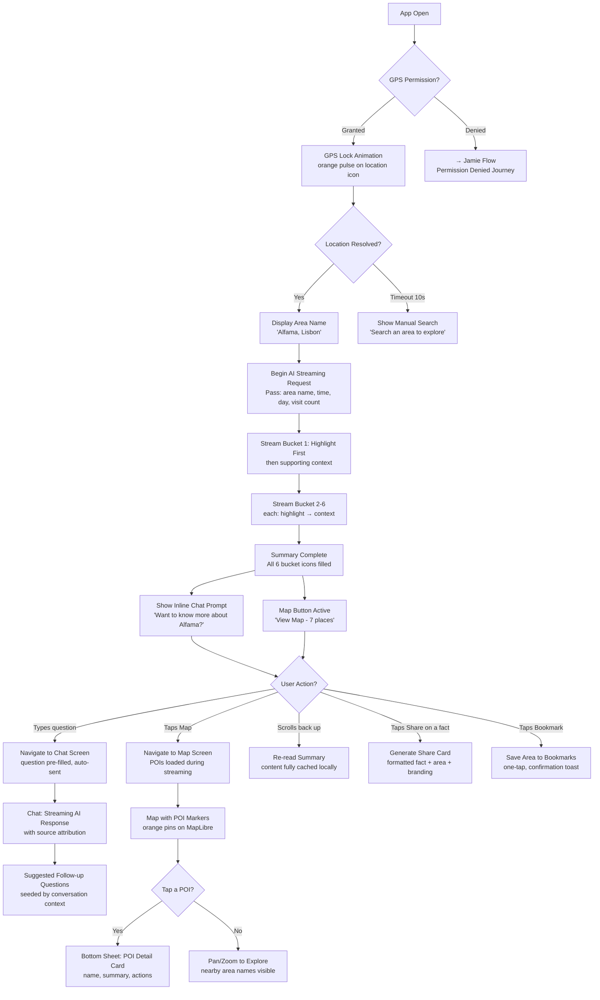
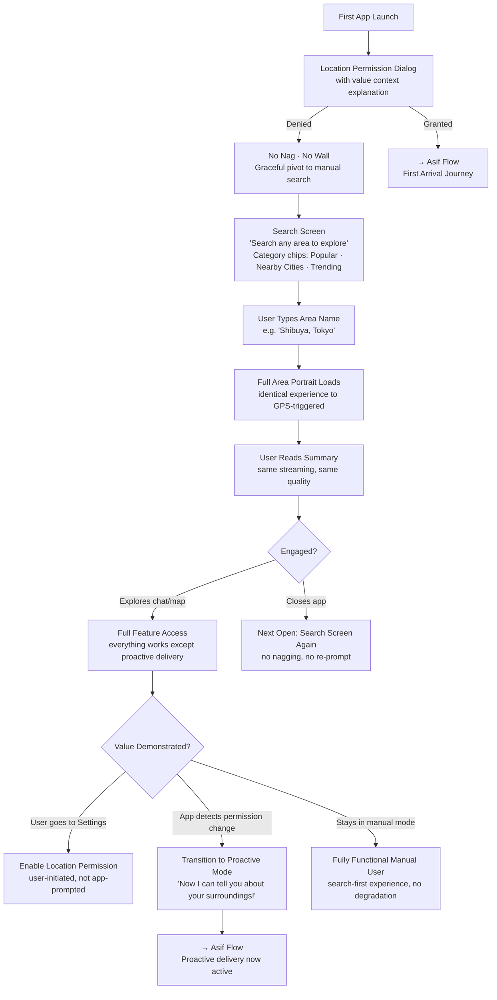
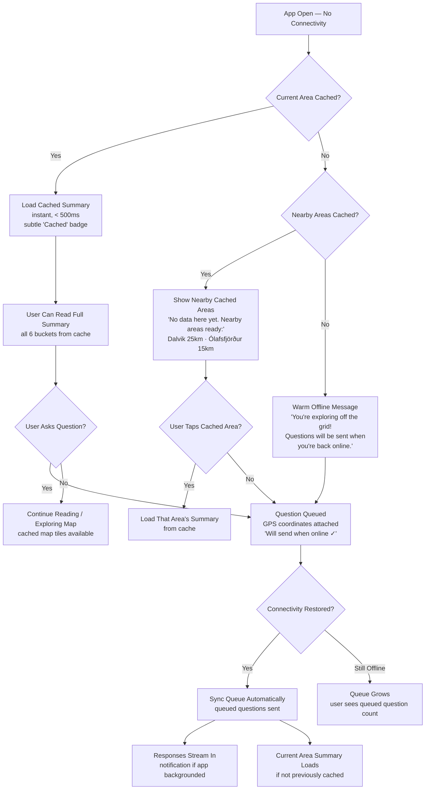

# UX Design Specification AreaDiscovery

**Author:** Asifchauhan
**Date:** 2026-03-03

---

## Executive Summary

### Project Vision

AreaDiscovery is an AI-powered area exploration companion that proactively delivers holistic area portraits — organized into six knowledge buckets (Safety, Character, What's Happening, Cost, History, Nearby) — the moment a user arrives somewhere new. The core UX promise is the "whoa, I didn't know that" moment delivered within seconds, without the user searching for anything. Built with Kotlin Multiplatform (Android first), the app combines proactive AI briefings, conversational depth via text chat, and visual discovery via an interactive map with AI-generated POI markers.

### Target Users

| User Archetype | Profile | Core UX Need | Key Journey |
|---------------|---------|-------------|------------|
| **Asif** (primary) | Globally mobile explorer, 30s, multilingual | Instant area knowledge with local language context on arrival | First arrival in a new neighborhood |
| **Maya** (primary) | Hometown resident, 25, Chicago | Discover hidden stories in her own neighborhood | Home turf rediscovery |
| **The Garcias** (secondary) | Vacationing family of 4 | Kid-friendly hidden gems + safety while moving through a city | Family exploration with serendipity |
| **Jamie** (secondary) | Privacy-conscious first-time user | Full value without granting location permission | Location-denied → permission conversion |
| **Priya** (secondary) | Remote area explorer, rural Iceland | Reliable experience in connectivity dead zones | Offline-first with graceful degradation |

### Key Design Challenges

1. **Information density vs. overwhelm** — Six buckets of area content must feel like a gift, not a wall of text. Streaming UX must reveal content progressively, inviting exploration over scrolling fatigue.
2. **Map + summary coexistence** — Home screen must balance a streaming summary card and interactive map simultaneously on mobile — a significant spatial challenge with dynamically growing content.
3. **Graceful degradation across connectivity states** — Full connectivity, partial data, offline with cache, and offline without cache all need distinct but cohesive UX patterns. No empty screens, no error walls — always something useful.
4. **Permission-denied as first-class experience** — Manual search for location-denied users must prove value so compellingly that users grant permission afterward, not feel like a fallback.
5. **Multilingual content flow** — Local language terms embedded naturally within the user's preferred language without feeling like a translation feature.

### Design Opportunities

1. **Streaming as signature delight** — Token-by-token content rendering becomes a brand-defining interaction. Content materializing bucket-by-bucket creates anticipation — "watching the story unfold."
2. **Temporal UI adaptation** — Time-of-day and day-of-week context can influence not just content but visual tone, making the same screen feel fresh every visit.
3. **Shareable content cards** — Individual facts or bucket sections designed as beautifully formatted shareable cards drive organic growth — the content markets itself.

### Key Decisions from Multi-Agent Review

1. **Attention choreography** — The first 10 seconds must have a deliberate emotional arc: what draws the eye first, what reveals second, what invites exploration third.
2. **Summary-first, map-second (Phase 1a)** — Full-screen summary card is the hero experience. Map is one tap away, not competing for screen space. Eliminates the dual-async-source problem and focuses validation on whether the content creates the "whoa" moment.
3. **Phase-layered UX** — Phase 1a must be complete and magical on its own. Phase 1b features layer on without breaking what already works.
4. **Chat entry point design** — The transition from passive summary reading to active AI conversation needs explicit design — a make-or-break handoff moment.
5. **Scannable depth** — Visual hierarchy must support both glanceable scanning (top-level) and rewarding deep reading (full six buckets). Target: 60%+ view full summary.
6. **Dual async coordination** — Streaming AI content leads; map tiles load in background. By the time users tap "View Map," it's ready. Map button shows a static affordance (pin count or mini preview) to signal more content exists.
7. **Emotional tone flexibility** — Different user journeys have different emotional entry points (curious, anxious, skeptical, casual, chaotic). UX tone must flex accordingly.

## Core User Experience

### Defining Experience

The core experience is **proactive area knowledge delivery**. Users open AreaDiscovery and within seconds receive a holistic portrait of their surroundings — history, safety, culture, cost, current events, and nearby points of interest — without typing a query or pressing a button. The app reads the user's location and streams a six-bucket area portrait directly to the screen.

The core loop: **Arrive → Open → Absorb → Explore deeper**

- **Arrive:** User enters a new area (or opens the app in any location)
- **Open:** App detects GPS location and begins AI area synthesis
- **Absorb:** Six-bucket summary streams progressively onto a full-screen card
- **Explore deeper:** User taps into the map for visual discovery or asks a follow-up question via chat

The interaction that must be absolutely flawless is the **first 5 seconds**: GPS lock → streaming content begins → at least one surprising fact visible. This is the "whoa, I didn't know that" moment. If this fails, nothing else matters.

### Platform Strategy

| Dimension | Decision |
|-----------|----------|
| **Primary platform** | Android (Kotlin/Compose) — touch-first, one-handed mobile use |
| **Secondary platform** | iOS via KMP + Compose Multiplatform (post-Android stabilization) |
| **Input mode** | Touch (V1), Voice STT/TTS added V1.5 |
| **Orientation** | Portrait-only for V1 |
| **Connectivity** | Online-first with offline cache fallback (Phase 1b) |
| **Key device capabilities** | GPS/location services, network state, map rendering |
| **Target devices** | Android 8.0+ (API 26+), typical mid-range to flagship phones |

**Phase 1a screen architecture:** Summary-first. Full-screen area portrait card is the hero. Map is one tap away (not split-screen). This focuses validation on content quality and eliminates the dual-async-source complexity.

### Effortless Interactions

| Interaction | How It Becomes Effortless |
|-------------|--------------------------|
| **Getting area knowledge** | Proactive — no search needed. Open the app, knowledge arrives via GPS. |
| **Reading the summary** | Streaming delivery — content appears progressively, no loading spinner. Bucket-by-bucket reveal creates anticipation. |
| **Exploring the map** | One tap from summary to map. POI markers pre-loaded during summary streaming. Mini preview or pin count on the map button signals content is ready. |
| **Asking a follow-up** | Chat entry point embedded naturally at the end of the summary or via a persistent input affordance. The summary content itself seeds curiosity. |
| **Understanding confidence** | Tiering is visual and inline — no extra taps. High-confidence content looks different from approximate content at a glance. |
| **Multilingual context** | Local terms embedded naturally in the user's language. No "translate" button — bilingual context is the default output format. |

### Critical Success Moments

1. **The "whoa" moment (second 3-5)** — First area summary reveals something the user didn't know about their surroundings. This is the product's reason to exist. If this doesn't land, nothing else matters.
2. **The curiosity hook (second 10-30)** — User reads a fact in the summary and wants to know more. They look for a way to ask a question. The transition from passive reading to active conversation must be frictionless and obvious.
3. **The share impulse (first minute)** — User learns something so interesting they screenshot it or share it. Content must be visually shareable — well-formatted, self-contained facts that make sense out of context.
4. **The trust establishment (first session)** — Confidence tiering, source links, and the AI acknowledging uncertainty build trust. The user learns to rely on the app because it's transparent about what it knows vs. approximates.
5. **The return trigger (next location change)** — User arrives somewhere new and instinctively opens the app. The proactive pattern has become a habit. The app is the first thing they reach for in a new area.

### Experience Principles

1. **Knowledge arrives, you don't search for it** — Proactive delivery is the defining UX pattern. The app anticipates curiosity and delivers before the user asks. Every design decision should reduce the gap between "arriving somewhere" and "understanding it."

2. **Content is the interface** — The area portrait IS the product. Minimize chrome, navigation, and UI complexity. The screen should feel like reading a beautifully curated briefing, not operating an app. Typography, spacing, and visual hierarchy do the heavy lifting.

3. **Stream, never load** — Users see content materializing, never a spinner. The streaming animation becomes a signature brand moment — watching the story of a place unfold in real time. Skeleton states are intentional, not placeholder.

4. **Always something useful** — No empty states. No error walls. No "no results." Cached content, nearby area suggestions, queued questions, graceful degradation messaging — there is always value on screen regardless of connectivity or data availability.

5. **Curiosity flows into conversation** — The summary sparks questions; the chat answers them. The boundary between "reading the briefing" and "talking to the AI" should be nearly invisible. The entire experience is one continuous flow of discovery.

## Desired Emotional Response

### Primary Emotional Goals

**Wonder + Belonging** — The dominant emotional experience is the thrill of discovering something you didn't know about a place, combined with a deepening sense of connection to your surroundings. The app transforms anonymous spaces into places with stories, making users feel like insiders rather than tourists — even in unfamiliar areas.

**Supporting emotions:**
- **Fascination** — "I had no idea this place had this history"
- **Empowerment** — "I understand this area better than people who've lived here for years"
- **Trust** — "This app is honest about what it knows and what it's guessing"
- **Calm confidence** — "Even when things go wrong, this app has my back"

### Emotional Journey Mapping

| Stage | Desired Emotion | Design Lever |
|-------|----------------|-------------|
| **First app open** | Anticipation → Wonder | Streaming content materializing bucket-by-bucket; no loading screen — the story begins immediately |
| **Reading the area portrait** | Fascination + Surprise | At least one "I didn't know that" fact per summary; visual hierarchy guides attention to the most surprising content first |
| **Exploring deeper (chat)** | Curiosity satisfied | Rich, sourced answers that reward the question; conversation feels like talking to a knowledgeable local guide |
| **Exploring the map** | Visual discovery delight | POI markers reveal hidden gems — places the user would never have found on their own |
| **Sharing a discovery** | Pride + social connection | Shareable content formatted to make the sharer look knowledgeable — "look what I found out" |
| **Return visit** | Comfortable familiarity + fresh surprise | The app remembers; shows only what's changed — "welcome back, here's what's new" |
| **Offline / sparse data** | Reassurance, not frustration | Graceful messaging that feels like a thoughtful friend: "I don't have info here yet, but here's what I have nearby" |
| **Home turf (Maya)** | Belonging + rediscovery | "Did you know?" moments about your own neighborhood build emotional connection to place |

### Micro-Emotions

| Micro-Emotion Pair | Target State | How We Achieve It |
|--------------------|--------------|--------------------|
| **Trust vs. Skepticism** | Trust | Confidence tiering on all content; AI acknowledges uncertainty transparently; verified sources for safety-critical info |
| **Delight vs. Satisfaction** | Delight | Content quality bar is "I didn't know that," not "that's useful." Every summary must contain at least one genuinely surprising insight |
| **Belonging vs. Tourism** | Belonging | Local language terms embedded naturally; hidden gems over tourist attractions; cultural context that makes users feel like insiders |
| **Calm vs. Anxiety** | Calm confidence | No error screens, no empty states; cached content and queued questions mean the app always has something reassuring to offer |
| **Curiosity vs. Indifference** | Active curiosity | Summary content is written to provoke follow-up questions — each bucket plants seeds for deeper exploration via chat |
| **Agency vs. Overwhelm** | Empowered agency | Six buckets are scannable, not mandatory. Users choose depth. No checklist pressure — discovery is opt-in exploration |

### Design Implications

| Emotional Goal | UX Design Approach |
|---------------|-------------------|
| **Wonder** | Streaming reveal animation — content materializes like a story being told. Typography and spacing give each fact room to breathe and land emotionally. |
| **Trust** | Inline confidence indicators (subtle, not intrusive). Source links on factual claims. AI explicitly says "I'm less certain about..." when appropriate. |
| **Belonging** | Local vocabulary and cultural references woven into content. Return visit mode that says "welcome back." Home turf framing as "your neighborhood" not "this area." |
| **Calm confidence** | Offline states designed as helpful, not broken. Warm language: "No data cached here yet — but Ólafsfjörður (15km ahead) is ready for you." Never technical error messages. |
| **Curiosity** | Chat prompt that references the summary: "Want to know more about the 1755 earthquake?" Suggested follow-up questions seeded by the content itself. |
| **Shareable pride** | Individual facts formatted as visually complete, self-contained cards. Share action produces a beautiful image/card, not a raw text dump. |

### Emotional Design Principles

1. **Surprise before utility** — Lead with the most fascinating fact, not the most practical. Utility keeps users; surprise makes them fall in love. The first thing a user reads should make them say "really?!"

2. **Honesty builds trust faster than confidence** — An AI that says "I'm not sure about this area" earns more trust than one that presents thin information as complete. Transparency is an emotional asset.

3. **Warmth in degradation** — When the experience is limited (offline, sparse data, permission denied), the tone should feel like a thoughtful friend saying "here's what I can do for you" — never a system displaying an error code.

4. **Discovery, not obligation** — Content depth is always opt-in. The six buckets are invitations to explore, not a checklist to complete. Users should feel empowered by choice, never overwhelmed by volume.

5. **Every place has a story** — Even data-sparse areas get a portrait. The AI finds *something* interesting about everywhere. No location should feel like a dead end — that destroys the core emotional promise.

## UX Pattern Analysis & Inspiration

### Inspiring Products Analysis

| Product | What It Does Well | Key UX Lesson for AreaDiscovery |
|---------|-------------------|--------------------------------|
| **Instagram** | Visual-first, minimal chrome, content IS the interface. Stories format delivers full-screen, swipeable content units. Sharing produces beautiful standalone cards. | Our summary screen should feel like scrolling Instagram — content fills the screen, chrome disappears. Share output must be visually beautiful and self-contained. |
| **Google Maps** | Instant location awareness on open. Bottom sheet pattern for map + content coexistence. Place cards on pin tap. Zero-state search suggestions. | Our map screen should use the bottom sheet pattern. POI cards should feel as natural as Google Maps place cards. Search should offer category chips, not a blank input. |
| **Yelp** | "Near me" as default — location-first, no setup. Bite-sized review snippets surface key info quickly. | Our proactive delivery mirrors Yelp's location-first approach but goes further — we deliver without the user even searching. Bite-sized facts over wall-of-text. |
| **TripAdvisor** | Traveler-verified trust badges on content. Curated "top things" aggregation from collective intelligence. | Our confidence tiering is the AI equivalent of TripAdvisor's trust badges. AI synthesis replaces manual review aggregation. |
| **TikTok** | Full-screen, one-content-unit-at-a-time. Algorithmic "For You" — content finds you. First 1-2 seconds determine engagement. | Content must hook in the first line. Proactive delivery = "For You" for places. |
| **Facebook** | News Feed habit loop (open → new content). "On This Day" temporal resurfacing. Reactions for nuanced feedback. | Open-app-get-content habit loop is our core loop. Return visit "what's changed" mirrors temporal resurfacing. |
| **Apple Weather** | Location-aware, proactive, single-scroll, content-rich. Opens knowing where you are. Entire experience is one beautiful continuous scroll — hourly flows into daily flows into UV index. | **Closest UX model to AreaDiscovery.** Our six-bucket summary should flow like Weather's data sections — one continuous, beautiful scroll where each section feels like a natural continuation, not a separate card. |

### Key Insight: We Are Not a Feed App

AreaDiscovery delivers **one rich portrait per location**, not many pieces of content in an infinite scroll. The interaction model is **deep scroll within a single piece** (Apple Weather) rather than **infinite scroll across many pieces** (Instagram, TikTok). This distinction is critical:

- **What transfers from social media:** Content-first visual design, minimal chrome, one-tap sharing, beautiful share cards, streaming content reveal.
- **What does NOT transfer:** Infinite scroll, algorithmic feed addiction, notification-driven re-engagement, engagement-over-value optimization.
- **Re-engagement model:** Context-triggered (location change), not habit-loop (push notifications). More like Google Maps than Instagram.

Because we are a **text-first app**, typography must do what imagery does in Instagram — create visual rhythm, guide the eye, and make reading feel like pleasure. Font weight hierarchy, spacing, and color are our primary design tools.

### Three-Screen Pattern Mapping

Each screen in AreaDiscovery borrows from the best-in-class app for that specific interaction type:

| Screen | UX Model | Pattern |
|--------|----------|---------|
| **Summary** | Apple Weather | Full-screen scrollable card. Six buckets flow as one continuous read. Content is the interface — minimal chrome, typographic hierarchy drives the experience. |
| **Map** | Google Maps | Interactive map with POI markers. Three-stop bottom sheet (collapsed: area name + teaser; half: summary; full: deep reading) for area/POI details over the map. |
| **Chat** | ChatGPT | Conversational UI with streaming responses. Suggested follow-up prompts seeded by summary content. Simple text input. |

### Transferable UX Patterns

**Navigation Patterns:**

| Pattern | Source | Application in AreaDiscovery |
|---------|--------|------------------------------|
| **Three-stop bottom sheet** | Google Maps | Map screen: POI or area details slide up in three stops (collapsed/half/full). User controls depth by dragging. |
| **Full-screen content scroll** | Apple Weather | Summary screen: six buckets as one continuous vertical scroll. Each section flows naturally into the next. |
| **Tab/chip navigation** | Google Maps, Instagram | Switch between Summary, Map, and Chat via bottom tabs. Simple, predictable, one-tap access. |
| **Category chips in search** | Google Maps | Manual search zero-state shows suggested areas or category chips rather than a blank input field. |

**Interaction Patterns:**

| Pattern | Source | Application in AreaDiscovery |
|---------|--------|------------------------------|
| **Content finds you (proactive)** | TikTok "For You" | Core loop: open app → area portrait delivered via GPS. Location replaces the recommendation algorithm. |
| **Streaming content reveal** | ChatGPT | Token-by-token rendering. Bucket-by-bucket progressive reveal. Content "unfolds" rather than "loads." |
| **One-tap share with preview** | Instagram, TikTok | Share action produces a formatted card (fact + area name + branding). Beautiful and self-contained. |
| **Pin tap → detail card** | Google Maps | POI marker tap opens a concise detail card with key info, actions (bookmark, share, navigate). |

**Visual Patterns:**

| Pattern | Source | Application in AreaDiscovery |
|---------|--------|------------------------------|
| **Content-first, chrome-minimal** | Instagram, Apple Weather | Summary and map screens maximize content. Navigation is subtle. Typography creates hierarchy, not UI widgets. |
| **Trust indicators inline** | TripAdvisor badges | Confidence tiering as subtle inline badges woven into content flow, not a separate section. |
| **Offline knowledge footprint** | Google Maps cached tiles | Phase 1b: cached areas visually distinct on map (warm glow or filled marker). Users can see what they "know." Uncached areas appear neutral. |

### Anti-Patterns to Avoid

| Anti-Pattern | Source | Why It's Dangerous for AreaDiscovery |
|-------------|--------|--------------------------------------|
| **Ad-driven ranking / pay-to-play** | Yelp, TripAdvisor | Destroys the "honest curation" trust promise. Recommendations must be genuine, not sponsored. |
| **Information wall / visual clutter** | TripAdvisor, Yelp | Six buckets could overwhelm. Scannable hierarchy and progressive disclosure are essential. |
| **Stale content without temporal context** | TripAdvisor reviews | Undated or old content feels unreliable. Temporal awareness is a core differentiator. |
| **Engagement addiction over value** | Facebook, TikTok | Optimize for "whoa" moments delivered, not minutes-in-app. Deliver value fast, let users go — they'll return because it's useful. |
| **Permission nagging / dark patterns** | Many apps | Location permission must be value-first. If denied, manual search must be genuinely excellent, not a pressure tactic. |
| **Empty states / error screens** | Most apps offline | "No internet connection" is the norm. AreaDiscovery must always show cached content, suggestions, or warm messaging. |

### Design Inspiration Strategy

**Adopt directly:**
- Apple Weather single-scroll, location-aware content model for summary screen
- Google Maps bottom sheet (three-stop) for map + detail coexistence
- Google Maps pin-tap → detail card for POI interactions
- Instagram-quality share cards for organic growth
- ChatGPT-style streaming content reveal for summary and chat

**Adapt for our context:**
- TikTok's "For You" → GPS-triggered proactive portrait (location replaces algorithm)
- Facebook's "On This Day" → return visit "here's what's changed" (temporal awareness)
- TripAdvisor trust badges → AI confidence tiering (algorithmic transparency)
- Google Maps search chips → area category suggestions for manual search fallback
- Google Maps cached tile visibility → offline knowledge footprint on map (Phase 1b)

**Actively avoid:**
- Yelp/TripAdvisor's ad-driven ranking and visual clutter
- Facebook/TikTok's engagement-over-value addiction patterns
- Any app's permission nagging or dark patterns
- Empty states and generic error screens

## Design System Foundation

### Design System Choice

**Material 3 (Material You) — Heavily Themed** using Jetpack Compose's built-in Material 3 components with extensive customization through design tokens (typography, color, shape, spacing).

### Rationale for Selection

| Factor | Decision Driver |
|--------|----------------|
| **Speed** | M3 is built into Compose — zero additional dependencies. Components (Card, Text, LazyColumn, BottomSheet) are production-ready. |
| **Accessibility** | WCAG compliance, TalkBack support, minimum touch targets (48dp), contrast ratios — all built-in via M3 defaults. |
| **Typography-driven identity** | M3's type scale (Display → Headline → Title → Body → Label) maps directly to our six-bucket content hierarchy. Custom fonts and weight overrides create visual identity without custom components. |
| **Dark mode** | M3 dynamic color and dark theme support out of the box. Important for nighttime use (Asif exploring at night, Garcias in Barcelona in the evening). |
| **Cross-platform** | Material 3 Compose works with Compose Multiplatform for the iOS port. One theme definition, two platforms. |
| **Solo developer** | Custom design systems require months of component work. M3 theming requires hours of token configuration. The right tradeoff for a 2-week Phase 1a. |

### Implementation Approach

**Theme Layer:**
- Custom `MaterialTheme` with overridden `ColorScheme`, `Typography`, and `Shapes`
- **Primary color palette: Orange, Beige, and White** — warm, exploratory, inviting. Orange conveys energy and discovery; beige grounds with earthiness and trust; white provides breathing room for text-heavy content.
- Custom font family optimized for readability at multiple sizes (area portraits are text-heavy)
- Rounded shape system aligned with card-based content presentation

**Component Strategy:**
- **Use M3 stock:** Buttons, TextFields, BottomSheet, NavigationBar, Cards, TopAppBar, Chips
- **Customize via theme:** Colors, typography, shapes, elevation — all through design tokens
- **Build custom:** Streaming text animation composable, confidence tier badge, bucket section header, map overlay controls, share card renderer

**Design Token Hierarchy:**

```
Theme
├── Colors
│   ├── Primary: Orange (action, emphasis, bucket icons, interactive elements)
│   ├── Surface: Beige (card backgrounds, content areas, warmth)
│   ├── Background: White (screen base, breathing space, contrast)
│   ├── On-Primary: White (text/icons on orange)
│   ├── On-Surface: Dark brown/charcoal (text on beige — high contrast)
│   ├── Confidence tiers (green/amber/red subtle accents)
│   └── Dark mode: Deep brown/charcoal base, muted orange, warm off-white
├── Typography (display for area name, headline for buckets, body for content, label for metadata)
├── Shapes (rounded cards, pill chips, circular markers)
├── Spacing (content padding, bucket gaps, card margins)
└── Motion (streaming reveal, bottom sheet, screen transitions)
```

### Customization Strategy

**Where stock M3 is sufficient:**
- Navigation bar, app bar, text fields, buttons, dialogs
- Bottom sheet mechanics (three-stop: collapsed/half/full)
- Search bar with category chips
- List/scroll containers

**Where heavy theming is needed:**
- Typography scale tuned for long-form reading (larger body text, generous line height)
- **Orange/beige/white palette** — orange for interactive elements and emphasis, beige for content surfaces, white for background and breathing space. Warm and exploratory, never cold or clinical.
- Card styling: beige surface cards on white background with subtle shadows, generous padding
- Dark mode: deep brown/charcoal base, muted orange accents, warm off-white text

**Where custom components are required:**
- **Streaming text composable** — Animated token-by-token text rendering with bucket-by-bucket reveal
- **Confidence tier badge** — Inline indicator (icon + color) showing content reliability level
- **Bucket section header** — Six-bucket visual header with icon, title, and expand/collapse affordance
- **POI detail card** — Map-overlay card with quick actions (bookmark, share, navigate)
- **Share card renderer** — Generates a beautiful standalone image/card from a selected fact or bucket
- **Offline status indicator** — Warm, non-intrusive messaging for degraded connectivity states

## Defining Core Experience

### The Defining Interaction

**"Open the app and it tells you everything about where you are."**

This is AreaDiscovery's Shazam moment — the interaction users describe to friends. No search, no taps, no setup. The user opens the app, and the place reveals itself through a streaming six-bucket portrait. The shift from "I search for information" to "the place tells me about itself" is the core UX innovation.

### User Mental Model

**Current model (pull-based):** Users expect to search for area information across fragmented sources — Google Maps for businesses, Google Search for listicles, ChatGPT for synthesis, TripAdvisor for reviews. Each source provides partial knowledge. None provides holistic area understanding.

**AreaDiscovery model (push-based):** The app proactively delivers a synthesized area portrait on open. The user's only action is opening the app. This model shift is slightly disorienting in the best way — like using Shazam for the first time: "Wait, it just... *knows*?"

**Potential confusion points and mitigations:**

| Confusion Point | Mitigation |
|----------------|------------|
| "Where's the search bar?" | Area name prominently displayed confirms the app already knows where you are. Search available but secondary. |
| "Is this accurate?" | Confidence tiering inline on all content. Source links on factual claims. |
| "What else can I do?" | After summary completes, "View Map" button and chat input appear as clear next actions. |
| "Why does it need my location?" | Value-first: demonstrate with manual search before asking for GPS permission (Jamie's journey). |

### Success Criteria

| Criterion | Target | Measurement |
|-----------|--------|-------------|
| Content appears without user searching | 100% of GPS-enabled sessions | Session analytics |
| First content visible | < 5 seconds from app open | Latency tracking |
| User scrolls past first bucket | 60%+ of sessions | Scroll depth tracking |
| User takes a second action (chat, map, bookmark) | 40%+ of sessions | Event tracking |
| User describes app as "it tells you about where you are" | Qualitative confirmation | User testing |

### Novel UX Patterns

**Pattern classification:** Novel recombination of established patterns.

| Aspect | Pattern Type | Detail |
|--------|-------------|--------|
| Proactive area delivery | **Novel** | No mainstream app pushes synthesized area knowledge on open. Zero user education needed — it just happens. |
| Streaming text reveal | Established | Users understand token-by-token AI responses from ChatGPT. Applied to area portraits. |
| Full-screen content scroll | Established | Apple Weather model — single scroll, section by section. |
| Map with tappable pins | Established | Google Maps universal pattern. |
| Chat with AI | Established | ChatGPT-style text input → streaming response. |
| **The combination** | **Novel** | Proactive push + streaming text + map + chat, all location-aware. Each pattern is familiar; the product-level combination is new and requires no learning. |

### Experience Mechanics — The First 30 Seconds

**Phase 1: Location Lock (Second 0–2)**
- App opens to full-screen summary view
- Subtle warm orange pulse on location icon indicates GPS lock in progress
- Area name appears at top once location resolves: "Alfama, Lisbon"
- Skeleton bucket headers (Safety, Character, What's Happening, Cost, History, Nearby) fade in on beige card surface

**Phase 2: Streaming Reveal (Second 2–8)**
- First bucket begins streaming (prioritized by most surprising content)
- Text materializes word-by-word on beige card background
- Active bucket header glows with orange accent
- Remaining buckets stream in sequence
- User can scroll ahead — already-streamed content is readable immediately
- White background provides breathing room between bucket sections

**Phase 3: Summary Complete (Second 8)**
- Subtle completion indicator (all six bucket icons filled)
- "View Map (7 places)" button appears at bottom with a single gentle pulse
- Chat input fades in: "Ask about Alfama..."
- Share icon available on each bucket section

**Phase 4: Exploration (Second 8–30+)**
- User reads, scrolls, absorbs — the "whoa" moment has landed
- Three clear next actions always visible: Map button, Chat input, Share on any fact
- No dead ends — every piece of content leads somewhere deeper

## Visual Design Foundation

### Color System

**Primary Palette: Orange, Beige, and White**

Warm, exploratory, and inviting. Orange conveys energy and discovery; beige grounds with earthiness and trust; white provides breathing room for text-heavy content.

**Light Mode:**

| Role | Color | Hex | Usage |
|------|-------|-----|-------|
| Primary | Warm Orange | `#E8722A` | Interactive elements, active bucket headers, CTAs, location pulse |
| Primary Variant | Deep Orange | `#C45A1C` | Pressed states, active navigation, links |
| Surface | Warm Beige | `#F5EDE3` | Card backgrounds, content areas, bucket sections |
| Background | White | `#FFFFFF` | Screen base, breathing space between cards |
| On-Primary | White | `#FFFFFF` | Text/icons on orange backgrounds |
| On-Surface | Dark Charcoal | `#2D2926` | Primary text on beige (contrast ratio > 7:1) |
| On-Surface Variant | Warm Gray | `#6B5E54` | Secondary text, metadata, timestamps |
| Confidence High | Muted Green | `#4A8C5C` | Verified/high-confidence indicator |
| Confidence Medium | Muted Amber | `#C49A3C` | Approximate content indicator |
| Confidence Low | Muted Red | `#B85C4A` | Low-confidence / AI-uncertain indicator |
| Error | Red | `#BA1A1A` | Error states |

**Dark Mode (Phase 1b implementation — defined here, shipped later):**

| Role | Color | Hex |
|------|-------|-----|
| Background | Deep Brown | `#1A1412` |
| Surface | Warm Dark Brown | `#2D2520` |
| Primary | Muted Orange | `#E89A5E` |
| On-Surface | Warm Off-White | `#EDE0D4` |
| On-Surface Variant | Warm Tan | `#A89888` |

Dark mode deferred to Phase 1b due to MapLibre dark tile style dependency and additional QA effort. Light mode is the brand identity for launch.

**Color application rules:**
- Orange is for interaction and emphasis only — never large background fills (prevents visual fatigue)
- Beige is the reading surface — all long-form content sits on beige cards
- White is breathing space — separates cards, provides contrast
- Beige cards on white require subtle elevation (1dp shadow) for visual separation — cards must feel like distinct objects, not colored regions
- Confidence colors are subtle inline accents, never dominant
- Confidence tiers implemented as M3 `AssistChip` components for speed

### Bucket Visual Identity

Each of the six knowledge buckets has a distinctive icon, creating a visual brand language that appears across summary headers, map filters, share cards, and marketing materials.

| Bucket | Icon | M3 Material Symbol | Color Treatment |
|--------|------|-------------------|----------------|
| **Safety** | Shield | `Shield` | Orange accent on header |
| **Character** | Palette | `Palette` | Orange accent on header |
| **What's Happening** | Calendar | `CalendarMonth` | Orange accent on header |
| **Cost** | Coins | `Payments` | Orange accent on header |
| **History** | Clock | `History` | Orange accent on header |
| **Nearby** | Compass | `Explore` | Orange accent on header |

All icons sourced from M3 Material Symbols — no custom icon design needed. Icons enable instant visual scanning: users recognize buckets by shape before reading the header text.

### Typography System

**Font: Inter** — Humanist sans-serif via Google Fonts (`androidx.compose.ui.text.googlefonts`). Variable-weight support (no separate font files for SemiBold). Warm, highly readable at all sizes, free, and zero bundling overhead.

**Type Scale:**

| Level | M3 Role | Size / Weight | Line Height | Usage |
|-------|---------|---------------|-------------|-------|
| Display | displayMedium | 28sp / Bold | 1.2x | Area name ("Alfama, Lisbon") |
| Headline | headlineSmall | 20sp / SemiBold | 1.3x | Bucket headers with icon (Safety, Character, History) |
| Title | titleMedium | 16sp / SemiBold | 1.3x | POI names, section titles, chat headers |
| Body | bodyLarge | 16sp / Regular | 1.5x | Main content — area portrait text, chat responses |
| Body Small | bodyMedium | 14sp / Regular | 1.5x | Source attributions, confidence labels |
| Label | labelMedium | 12sp / Medium | 1.4x | Metadata, timestamps, badge text, map labels |

**Typography principles:**
- Body text at 16sp with 1.5x line height for comfortable long-form mobile reading
- Bold used sparingly — SemiBold for hierarchy, Regular for reading
- Dark charcoal (#2D2926) on beige (#F5EDE3) for primary content (warm, high-contrast, never stark black-on-white)
- Orange used for interactive text only (links, tappable elements) — never for body content
- Respects system font scaling for accessibility

### Spacing & Layout Foundation

**Base unit:** 8dp — all spacing derived from multiples of 8.

| Token | Value | Usage |
|-------|-------|-------|
| xs | 4dp | Inline spacing, icon-to-text gap |
| sm | 8dp | Tight element grouping |
| bucket-internal | 12dp | Gap between bucket header and body text within a section |
| md | 16dp | Content padding, card internal padding, screen edge margins |
| lg | 24dp | Bucket gap — breathing room between bucket sections |
| xl | 32dp | Major section breaks, screen section separators |
| touch | 48dp | Minimum touch target (M3 accessibility) |

**Layout principles:**
1. **Single column, full-width** — No multi-column layouts. Content flows top-to-bottom on mobile.
2. **Generous vertical spacing** — 24dp between bucket sections. Text-heavy content needs room to breathe.
3. **Edge-to-edge beige cards** — Summary cards stretch full width on white background. Rounded top corners (16dp radius). 1dp elevation shadow for visual separation from white background.
4. **Bottom-anchored actions** — Map button and chat input fixed to bottom, always accessible during scroll.
5. **Content-first margins** — 16dp horizontal padding ensures content never touches screen edges.

### Accessibility Considerations

| Requirement | Implementation |
|-------------|---------------|
| **Color contrast** | Dark charcoal (#2D2926) on beige (#F5EDE3) exceeds WCAG AA 4.5:1 ratio. Orange on white verified for large text (3:1). |
| **Touch targets** | All interactive elements minimum 48dp per M3 guidelines. |
| **Font sizing** | Body text at 16sp minimum. Respects system font scaling. |
| **Color independence** | Confidence tiers use icon + color + text label — never color alone. |
| **Dark mode** | Full dark mode palette defined, implementation Phase 1b. |
| **Screen reader** | All bucket headers, POI markers, and interactive elements have content descriptions. Map POIs available as accessible list view alternative. |
| **Reduced motion** | When system reduced motion is enabled, streaming replaced with section-by-section fade-in (200ms per section). Progressive but not animation-dependent — avoids wall-of-text overwhelm while respecting the accessibility setting. |

## Design Direction Decision

### Design Directions Explored

Six layout directions were explored via interactive HTML mockups (`ux-design-directions.html`), each showing the Alfama, Lisbon area portrait with the orange/beige/white palette:

| Direction | Name | Model | Verdict |
|-----------|------|-------|---------|
| A | Card Stack | Beige cards stacked on white | Good separation but card chrome breaks reading flow |
| **B** | **Continuous Scroll** | **Apple Weather flow** | **CHOSEN — best reading experience, natural streaming** |
| C | Tabbed Buckets | One bucket at a time | Breaks "story unfolding" feel; better for reference later |
| D | Hero Fact + List | "Did you know?" hook + list | Strong hook but requires taps to read; two-level nav |
| E | Map-Forward Split | Google Maps + bottom sheet | Better as Phase 1b map screen, not primary summary |
| F | Story Mode | Instagram Stories swipe | Immersive but can't scan all buckets; 6 swipes for full portrait |

### Chosen Direction

**Direction B: Continuous Scroll (Apple Weather Model)**

The summary screen is one continuous vertical scroll with subtle section dividers between buckets. Content flows naturally from Safety → Character → What's Happening → Cost → History → Nearby as a single reading experience. No cards, no tabs, no swipes — just a beautifully typeset story that streams in progressively.

**Key elements of Direction B:**
- **Collapsing orange gradient header** — Full gradient with area name, visit context ("First visit"), and temporal context chip ("Morning — cafés, markets, quiet streets") on load. Collapses to slim area-name bar on scroll via M3 `MediumTopAppBar` with `enterAlwaysScrollBehavior`. Maximizes content space for streaming.
- **Continuous bucket sections** separated by subtle 1px beige dividers, not card boundaries
- **Highlight-first streaming order** — Each bucket streams the highlight fact first (the hook in a beige callout with orange left border), then supporting context. "Whoa" lands immediately, depth follows.
- **Inline chat prompt at scroll end** — After the last bucket (Nearby), a contextual prompt appears: "Want to know more about Alfama?" with text input. Typing navigates to Chat screen with question pre-filled and auto-sent. Catches users at peak curiosity.
- **Bottom navigation bar** with Summary, Map, Chat, and Saved tabs (orange active state)

### Bucket Anatomy

Each bucket within the continuous scroll follows this visual structure:

```
[Bucket Icon] [Bucket Title]                    ← headlineSmall, 20sp SemiBold
┌─────────────────────────────────────────────┐
│ 💡 Highlight fact                            │  ← Streams FIRST (the hook)
│ (beige bg #F5EDE3, 3px orange left border)  │     Surprising, actionable, or safety-critical
└─────────────────────────────────────────────┘
Supporting context paragraph...                  ← Streams SECOND (the depth)
More detail if available...                      ← Streams THIRD (optional)
[Confidence chip: ✓ Verified | ~ Approximate]   ← M3 AssistChip, inline
─────────────────── divider ───────────────────  ← 1px beige, 24dp vertical gap
```

**Highlight fact criteria (AI-structured):**
- **Surprising** — contradicts common assumptions ("laundry is cultural pride, not poverty")
- **Actionable** — something the user can do now ("fado festival this weekend")
- **Safety-critical** — things the user needs to know ("pickpocket-prone at night near X")
- Maximum one highlight per bucket. No forced highlights — if nothing is genuinely surprising, omit the callout.

**AI structured output per bucket:**
```json
{
  "bucket": "Safety",
  "highlight": "Pickpocketing increases near tourist clusters...",
  "content": "Alfama is generally safe during daytime...",
  "confidence": "high",
  "sources": ["..."]
}
```

### Design Rationale

| Factor | Why Direction B Wins |
|--------|---------------------|
| **Streaming UX** | Continuous scroll is the most natural surface for token-by-token streaming. No card boundaries interrupt the reveal. |
| **Reading experience** | Long-form text reads best on a continuous surface. Apple Weather proves this at scale. |
| **"Story unfolding" feel** | A single flowing narrative serves the emotional design principle better than discrete cards. |
| **Scannable depth** | Bucket headers with icons create scanning anchors. Highlight callouts draw the eye. Users can skim headers or read deeply. |
| **Content is the interface** | Minimal chrome. Typography and spacing do the structural work. |
| **Highlight-first streaming** | Users see the "whoa" fact before the explanation. Hook lands immediately, depth follows. |
| **Curiosity-to-conversation** | Inline chat prompt at scroll end catches users at peak curiosity within the same content flow. |
| **Simplest implementation** | One `LazyColumn` with section headers. No card layout logic, no tab state, no swipe handlers. Fastest for Phase 1a. |

### Implementation Approach

**Summary screen composable structure:**

```
Scaffold(topBar = MediumTopAppBar with enterAlwaysScrollBehavior)
└── LazyColumn (connected to scroll state)
    ├── Header content (visit context, time chip)
    ├── Bucket: Safety
    │   ├── BucketHeader (icon + title)
    │   ├── HighlightCallout (if present — streams first)
    │   ├── ContentText (streams second)
    │   └── ConfidenceChip (if applicable)
    ├── BucketDivider (1px beige, 24dp vertical spacing)
    ├── Bucket: Character (same structure)
    ├── BucketDivider
    ├── Bucket: What's Happening
    ├── BucketDivider
    ├── Bucket: Cost
    ├── BucketDivider
    ├── Bucket: History
    ├── BucketDivider
    ├── Bucket: Nearby
    ├── InlineChatPrompt ("Want to know more about Alfama?")
    └── Spacer (bottom nav clearance)
BottomNavigationBar (Summary | Map | Chat | Saved)
```

**Summary screen is a pure read-only surface.** The inline chat prompt is a navigation trigger — typing navigates to the Chat screen with the question pre-filled. No inline chat state on the summary screen.

**Borrowed elements from other directions:**
- Direction D's "Did you know?" concept → applied as highlight fact callouts within the continuous scroll
- Direction E's bottom sheet → reserved for the Map screen POI details (Phase 1a secondary screen)
- Direction F's story progress → potential future enhancement for bucket-by-bucket sharing

## User Journey Flows

### Journey 1: First Arrival — Asif in Alfama (Phase 1a Core Flow)

The primary user flow that defines the entire product experience. Every design decision serves this journey.

**Entry point:** User opens the app (new area or first launch with GPS enabled)



**Key flow decisions:**
- GPS timeout (10s) falls back to manual search — never a dead end
- Streaming begins before full summary is ready — user sees content within 2 seconds
- Highlight facts stream first within each bucket — "whoa" lands immediately
- Map button shows POI count as a static affordance during streaming
- Summary screen is read-only; chat prompt navigates to a separate screen
- All content cached locally on view — revisiting the summary is instant

### Journey 2: Permission Denied — Jamie's Onboarding (Phase 1b)

The critical fallback that converts permission-deniers into engaged users by demonstrating value first.

**Entry point:** User denies location permission on first launch



**Key flow decisions:**
- Zero nagging after denial — no re-prompts, no permission walls, no degraded UI
- Manual search is a first-class experience — identical summary quality, full chat/map access
- Category chips in search zero-state reduce friction (Popular, Nearby Cities, Trending)
- If user later enables location in system settings, app detects and transitions gracefully
- Manual-only users are fully supported — search-first is a valid permanent mode

### Journey 3: Offline Explorer — Priya in Iceland (Phase 1b)

Defines the "always something useful" principle across four connectivity states.

**Entry point:** User opens app without internet connectivity



**Four connectivity states and their UX:**

| State | What User Sees | Emotional Tone |
|-------|---------------|----------------|
| **Online** | Full streaming summary | Wonder, discovery |
| **Cached area, offline** | Instant cached summary with "Cached" badge | Reassurance — "we've got this covered" |
| **Uncached area, nearby cache exists** | Nearby cached area suggestions | Helpful — "here's what we have close by" |
| **Uncached area, no nearby cache** | Warm message + question queue | Calm — "we'll catch up when you're back online" |

**Key flow decisions:**
- Cached summaries load in < 500ms with a subtle badge — never pretend it's live
- Nearby cached areas surfaced proactively — the app helps even when it can't fully serve
- Question queue is visible (count shown) so users know their questions will be answered
- Connectivity restoration triggers automatic sync — no user action needed
- Offline map tiles via MapLibre's built-in caching work independently

### Journey Patterns

**Reusable patterns across all journeys:**

| Pattern | Description | Used In |
|---------|-------------|---------|
| **Streaming Summary** | AI content streams bucket-by-bucket, highlight-first. Same composable regardless of trigger (GPS, search, cache). | All journeys |
| **Graceful Fallback Chain** | GPS fails → manual search. Online fails → cache. Cache misses → nearby cache. Nearby misses → warm message + queue. Always something useful. | Asif (GPS timeout), Jamie (permission denied), Priya (offline) |
| **Navigation Trigger** | Inline prompts (chat prompt, map button) navigate to separate screens with context pre-loaded. Source screen stays pure. | Summary → Chat, Summary → Map |
| **One-Tap Action** | Bookmark, share, and feedback are single-tap with confirmation toast. No dialogs, no confirmation screens. | All journeys |
| **Warm Degradation Messaging** | Offline/error states use conversational language ("No data here yet" not "Error: No connection"). Warm gray text, beige background. Never red error screens. | Priya (offline), Asif (GPS timeout) |
| **Bottom Sheet Detail** | Map POI details, area details on map screen use three-stop bottom sheet (collapsed/half/full). | Map screen across all journeys |

### Flow Optimization Principles

1. **Zero steps to first value** — GPS-enabled users see content without any interaction. The app does the work.
2. **Maximum one tap to any feature** — From the summary, map is one tap, chat is one tap (or inline prompt), bookmark is one tap, share is one tap.
3. **No dead ends** — Every state has a next action. Offline has a queue. Permission denied has search. Sparse data has "AI acknowledges limited knowledge." Error has cached content.
4. **Context carries forward** — Chat screen knows what area the user was reading about. Map screen knows which POIs were in the summary. Bookmarks link back to the full portrait.
5. **Feedback is silent** — Bookmarks, thumbs up/down, and shares show a brief toast, not a dialog. The user's reading flow is never interrupted.

## Component Strategy

### Design System Components

**M3 Components Used (stock, themed via design tokens):**

| M3 Component | AreaDiscovery Usage | Customization |
|---|---|---|
| `MediumTopAppBar` | Collapsing header with area name | Orange gradient, `enterAlwaysScrollBehavior` |
| `LazyColumn` | Summary screen continuous scroll | Connected to collapsing header scroll state |
| `NavigationBar` | Bottom nav: Summary / Map / Chat / Saved | Orange active indicator |
| `BottomSheetScaffold` | Map screen POI detail sheet | Three-stop (collapsed/half/full) |
| `AssistChip` | Confidence tier badges (green/amber/red) | Custom icon + color per tier |
| `TextField` / `OutlinedTextField` | Chat input, manual search input | Beige surface, orange cursor |
| `IconButton` | Share, bookmark, navigate actions | 48dp touch target, orange active |
| `HorizontalDivider` | Bucket section dividers | 1px, beige `#F5EDE3` |
| `Text` | All typography roles | Inter font, custom type scale |
| `FilterChip` | Category chips in search zero-state | Orange selected state |
| `Snackbar` | Confirmation toasts (bookmark, share, queue) | Charcoal background, warm tone |
| `CircularProgressIndicator` | GPS lock animation | Orange tint |
| `ModalBottomSheet` | Additional context overlays | Beige surface |
| `SearchBar` | Manual area search | M3 SearchBar with category chips |
| `Card` | POI detail card container, share card base | Beige surface, 1dp elevation |

All M3 components are themed through the project's custom `MaterialTheme` — no per-component color overrides needed. The orange/beige/white palette and Inter typography propagate automatically.

### Custom Components

#### 1. StreamingTextComposable

**Purpose:** Renders AI-generated text token-by-token, creating the signature "story unfolding" animation that defines the brand experience.

**Usage:** Summary screen bucket content, chat responses, POI descriptions.

**Anatomy:**
```
┌──────────────────────────────────────────┐
│ Text that appears word ← cursor blink    │
│ by word as tokens arrive from the AI     │
│ response stream...                       │
└──────────────────────────────────────────┘
```

**States:**

| State | Behavior |
|---|---|
| Idle | Empty — awaiting stream |
| Streaming | Text appears token-by-token (~30ms per token). Cursor blink at insertion point. |
| Complete | Full text displayed. Cursor disappears. No visual difference from static text. |
| Reduced Motion | Section fade-in (200ms) instead of token-by-token. Full text appears at once per section. |

**Interaction:** Read-only. User can scroll past while streaming continues below the fold.

**Accessibility:** `LiveRegion.Polite` — TalkBack announces new content without interrupting. Complete text readable once streaming finishes.

**Implementation:** Kotlin `Flow<String>` drives a `mutableStateOf<String>` that appends tokens. `AnimatedVisibility` with fade for reduced motion fallback.

#### 2. BucketSectionHeader

**Purpose:** Visual anchor for each of the six knowledge buckets. Enables scanning by icon shape before reading text.

**Usage:** Summary screen — one per bucket, six total.

**Anatomy:**
```
[🛡️ icon]  Safety                    [streaming indicator]
  24dp      headlineSmall 20sp         (pulsing dot while streaming)
  orange    SemiBold, charcoal
```

**States:**

| State | Visual |
|---|---|
| Skeleton | Gray placeholder icon + text shimmer. Appears during GPS lock. |
| Streaming | Orange icon, title visible, pulsing orange dot on right edge. |
| Complete | Orange icon, title visible, dot disappears. |

**Variants:** 6 variants (one per bucket) — differ only in icon (`Shield`, `Palette`, `CalendarMonth`, `Payments`, `History`, `Explore`) and title text.

**Accessibility:** Each header is a heading landmark. `contentDescription = "$bucketName section"`. Enables TalkBack heading navigation.

**Implementation:** `Row` with `Icon` (M3 Material Symbol) + `Text` (headlineSmall) + optional `AnimatedVisibility` pulsing dot.

#### 3. HighlightFactCallout

**Purpose:** Visually distinguishes the "whoa" fact — the single most surprising, actionable, or safety-critical insight in each bucket.

**Usage:** Summary screen — zero or one per bucket. Streams first within each bucket.

**Anatomy:**
```
┌──────────────────────────────────────────────┐
│ ▌ The hanging laundry in Alfama isn't        │
│ ▌ poverty — it's a centuries-old cultural    │
│ ▌ tradition that residents fiercely protect. │
└──────────────────────────────────────────────┘
 3dp orange left border │ beige #F5EDE3 bg │ 12dp internal padding
 bodyLarge 16sp Regular │ charcoal #2D2926
```

**States:**

| State | Behavior |
|---|---|
| Streaming | Text streams token-by-token inside the callout. Orange border visible immediately. |
| Complete | Full highlight text displayed. Static. |
| Absent | No callout rendered. Bucket goes straight to supporting context. |

**Accessibility:** `semantics { heading() }` — screen readers identify as a key callout. Role: complementary landmark.

**Implementation:** `Surface` (beige) with `Modifier.drawBehind` for the orange left border (3dp). Contains `StreamingTextComposable`.

#### 4. InlineChatPrompt

**Purpose:** Catches users at peak curiosity (end of summary scroll) and bridges to the Chat screen. Navigation trigger, not inline chat.

**Usage:** Summary screen — appears after the last bucket (Nearby).

**Anatomy:**
```
─────────────── divider ───────────────
     💬  Want to know more about Alfama?
     ┌─────────────────────────────────┐
     │ Ask anything...                 │  ← styled like TextField
     └─────────────────────────────────┘
```

**States:**

| State | Behavior |
|---|---|
| Hidden | Not visible until summary streaming completes. |
| Visible | Fades in after last bucket finishes streaming. |
| Focused | User taps input → navigates to Chat screen immediately with focus on chat input. |
| Typed | User types text → navigates to Chat screen with question pre-filled and auto-sent. |

**Interaction:** `onFocusChanged` triggers navigation to Chat screen. If text entered before focus navigation, text carries as pre-filled query. No local text state management.

**Accessibility:** `contentDescription = "Ask a question about $areaName"`. Keyboard focus triggers same navigation.

**Implementation:** `OutlinedTextField` (read-only visually) with `onFocusChanged` callback that calls `navController.navigate("chat?query=$text")`. Prompt text above is a `Text` composable.

#### 5. ConfidenceTierBadge

**Purpose:** Inline indicator showing AI content reliability level. Builds trust through transparency.

**Usage:** Summary screen — one per bucket. Map POI detail cards.

**Anatomy:**
```
[✓ Verified]     [~ Approximate]     [? Limited Data]
 green chip        amber chip           red chip
```

**Variants:**

| Tier | Icon | Color | Label | Usage |
|---|---|---|---|---|
| High | `✓` (Verified) | Muted Green `#4A8C5C` | "Verified" | Well-sourced, cross-referenced facts |
| Medium | `~` (Approximate) | Muted Amber `#C49A3C` | "Approximate" | AI-synthesized, reasonable confidence |
| Low | `?` (Limited) | Muted Red `#B85C4A` | "Limited Data" | Sparse sources, AI acknowledges uncertainty |

**Accessibility:** Icon + color + text label — never color alone. `contentDescription = "Confidence level: $tierName"`.

**Implementation:** M3 `AssistChip` with custom `leadingIcon`, `colors = AssistChipDefaults.assistChipColors(containerColor = tierColor.copy(alpha = 0.15f))`, and label text.

#### 6. ShareCardRenderer

**Purpose:** Generates a beautiful standalone image from a selected fact or bucket for social sharing. Drives organic growth.

**Usage:** Triggered by share action on any bucket or highlight fact.

**Anatomy:**
```
┌──────────────────────────────────┐
│  AreaDiscovery                   │  ← brand mark, small
│                                  │
│  "The hanging laundry in Alfama  │
│   isn't poverty — it's a         │
│   centuries-old cultural         │
│   tradition."                    │  ← the fact, large type
│                                  │
│  📍 Alfama, Lisbon               │  ← area name
│  🛡️ Safety · Verified            │  ← bucket + confidence
└──────────────────────────────────┘
  beige background, orange accents
```

**States:**

| State | Behavior |
|---|---|
| Generating | Brief shimmer overlay while bitmap renders |
| Ready | Share sheet opens with rendered image |
| Error | Falls back to plain text share |

**Content Guidelines:** Fact text truncated at 280 characters. Area name always included. Bucket icon and confidence tier provide context. Brand mark subtle — content-first.

**Implementation:** Off-screen `Canvas` composable renders the card layout to a `Bitmap`. Uses `ShareCompat.IntentBuilder` for the share action. No external library needed.

#### 7. POIDetailCard

**Purpose:** Shows point-of-interest details when a map marker is tapped. Lives inside the bottom sheet on the Map screen.

**Usage:** Map screen — appears in bottom sheet when a POI marker is tapped.

**Anatomy:**
```
┌──────────────────────────────────────────┐
│  📍 Time Out Market Lisboa               │  ← titleMedium
│  Food Hall · $$                          │  ← bodyMedium, warm gray
│  "Curated food hall with 24 restaurants  │
│   and rooftop bar overlooking the river" │  ← bodyLarge, AI-generated
│                                          │
│  [🔖 Save]  [📤 Share]  [🧭 Navigate]   │  ← IconButton row
│  ✓ Verified                              │  ← ConfidenceTierBadge
└──────────────────────────────────────────┘
```

**States:**

| State | Behavior |
|---|---|
| Loading | Skeleton text shimmer while AI generates description |
| Loaded | Full content with actions |
| Cached | Same as loaded, with subtle "Cached" badge |

**Actions:** Save (bookmark with toast), Share (renders share card), Navigate (opens external maps intent).

**Accessibility:** All actions have content descriptions. Touch targets 48dp. Card content readable in sequence by TalkBack.

**Implementation:** M3 `Card` (beige surface, 1dp elevation) inside `BottomSheetScaffold` content. Action row uses `IconButton` with 48dp targets.

#### 8. OfflineStatusIndicator (Phase 1b)

**Purpose:** Persistent, warm inline banner for degraded connectivity states. Non-intrusive — sits at top of content, doesn't block reading.

**Usage:** Summary screen, map screen — appears when connectivity is degraded.

**Anatomy:**
```
┌──────────────────────────────────────────┐
│  📡  You're exploring off the grid.      │
│      Questions will be sent when you're  │
│      back online. (2 queued)             │
└──────────────────────────────────────────┘
  warm beige bg, warm gray text, no dismiss
```

**States:**

| State | Display |
|---|---|
| Online | Hidden |
| Cached area offline | "Viewing cached summary · Last updated [date]" |
| No cache offline | "Off the grid" message + queued question count |
| Reconnecting | "Reconnecting..." with subtle orange pulse |

**Accessibility:** `LiveRegion.Polite` — announces connectivity changes. Descriptive text (no icon-only communication).

**Implementation:** `AnimatedVisibility` banner at top of `LazyColumn`. Reads from a `ConnectivityManager` flow. Not dismissible — disappears automatically on reconnection.

### Component Implementation Strategy

**Foundation Layer (M3 stock, themed):**
All standard UI building blocks — navigation, inputs, containers, feedback — come from Material 3 and inherit the orange/beige/white theme through `MaterialTheme` composition. Zero custom styling per component instance.

**Custom Layer (built for AreaDiscovery):**
Eight custom composables address the specific gaps between M3's component library and AreaDiscovery's unique experience requirements. Each custom component:
- Uses M3 design tokens exclusively (no hardcoded colors, sizes, or fonts)
- Is a stateless `@Composable` function with state hoisted to ViewModel
- Includes `@Preview` annotations for design iteration in Android Studio
- Has accessibility built-in from day one (content descriptions, touch targets, color independence, screen reader support)
- Follows Compose best practices (single responsibility, minimal recomposition scope)

**Component Dependency Map:**
```
StreamingTextComposable
├── used by: HighlightFactCallout
├── used by: BucketSectionHeader (drives streaming state)
├── used by: POIDetailCard (description field)
└── used by: Chat screen messages

ConfidenceTierBadge
├── used by: Summary screen (per bucket)
├── used by: POIDetailCard
└── used by: ShareCardRenderer

ShareCardRenderer
├── uses: ConfidenceTierBadge (static render)
└── triggered by: IconButton on buckets and POIDetailCard
```

### Implementation Roadmap

**Phase 1a — Core Components (MVP launch):**

| Component | Needed For | Complexity | Dependencies |
|---|---|---|---|
| StreamingTextComposable | Summary streaming — the entire brand moment | Medium | AI response Flow |
| BucketSectionHeader | Summary screen structure and scanning | Low | M3 Icon, Text |
| HighlightFactCallout | "Whoa" moment delivery per bucket | Low | StreamingTextComposable |
| InlineChatPrompt | Summary → Chat navigation bridge | Low | NavController |
| ConfidenceTierBadge | Trust establishment on all content | Low | M3 AssistChip |
| ShareCardRenderer | Organic growth via social sharing | Medium | Canvas, ShareCompat |
| POIDetailCard | Map screen POI details and actions | Medium | Card, ConfidenceTierBadge |

**Phase 1b — Supporting Components:**

| Component | Needed For | Complexity | Dependencies |
|---|---|---|---|
| OfflineStatusIndicator | Priya's offline journey UX | Low | ConnectivityManager Flow |
| Offline Knowledge Footprint | Map cached area visualization | High | MapLibre custom overlay |
| Dark Mode Token Set | Night usage across all components | Medium | Full theme duplication |

**Phase 2 — Enhancement Components:**

| Component | Needed For | Complexity | Dependencies |
|---|---|---|---|
| Return Visit Diff Card | "Here's what changed" for returning users | Medium | Content diffing logic |
| Voice Input Indicator | STT integration (V1.5) | Low | Speech recognition API |
| Bucket Share Story | Instagram-style bucket story export | High | Multi-frame image generation |

## UX Consistency Patterns

### Button Hierarchy

AreaDiscovery is content-first with minimal interactive chrome. The button hierarchy reflects this — most interactions are one-tap actions, not multi-step flows.

| Level | M3 Component | Visual | Usage |
|---|---|---|---|
| **Primary** | `FilledButton` | Orange `#E8722A` bg, white text | One per screen max. "View Map (7 places)" on summary. "Send" in chat. |
| **Secondary** | `OutlinedButton` | Orange outline, orange text on white/beige | "Search an Area" on manual search. "Try Again" on error recovery. |
| **Tertiary** | `TextButton` | Orange text, no background | Inline actions: "See sources", "Show more". |
| **Icon Action** | `IconButton` | 48dp touch target, orange on tap | Share, bookmark, navigate. Always with tooltip/content description. |

**Button rules:**
- Never more than one primary button visible at a time
- Icon actions are the dominant interaction pattern (share, bookmark, navigate) — always 48dp minimum
- No "Cancel/OK" dialog patterns — use Snackbar with undo for reversible actions
- Disabled state: 38% opacity, never remove the button entirely (avoid layout shift)

### Feedback Patterns

**Success Feedback:**

| Action | Feedback | Duration | Undo? |
|---|---|---|---|
| Bookmark saved | Snackbar: "Alfama saved to bookmarks" | 4s | Yes — "Undo" action |
| Share triggered | System share sheet opens | N/A | N/A |
| Question queued (offline) | Snackbar: "Question queued — will send when online" | 4s | No |
| Chat message sent | Message appears in chat flow | N/A | N/A |

**Error Feedback:**

| Error | Display | Tone | Recovery |
|---|---|---|---|
| GPS timeout | Inline: "Can't find your location. Search an area instead?" | Warm, helpful | Secondary button to manual search |
| AI streaming failure | Inline: "Couldn't load this area right now. Tap to retry." | Calm, actionable | TextButton: "Retry" |
| Network lost mid-stream | OfflineStatusIndicator banner + partial content stays visible | Reassuring | Auto-retry on reconnection |
| Share card generation fail | Snackbar: "Couldn't create image — shared as text instead" | Graceful | Automatic fallback to text share |

**Feedback principles:**
- **Never modal dialogs for feedback** — always Snackbar or inline messaging
- **Never red error screens** — warm beige background, warm gray text, conversational language
- **Never block the UI** — errors appear alongside existing content, never replacing it
- **Always offer a next action** — retry, search manually, view cached content, or queue for later

### Loading & Empty States

AreaDiscovery's "stream, never load" principle means traditional loading spinners are rare.

| State | Pattern | Visual |
|---|---|---|
| **GPS resolving** | Pulsing orange dot on location icon | Subtle animation, no blocking overlay |
| **AI streaming** | Token-by-token text reveal | Content IS the loading state. Skeleton bucket headers appear immediately. |
| **Map tiles loading** | MapLibre built-in tile loading | Standard map tile progressive loading |
| **POI detail loading** | Skeleton shimmer in bottom sheet | Gray text placeholders with shimmer animation |
| **First launch** | Location permission context screen | Value explanation → permission request. Never a blank screen. |
| **No cached data offline** | Warm message with nearby suggestions | "You're exploring off the grid!" — never "No data available" |
| **Search zero-state** | Category chips + popular areas | FilterChips: Popular, Nearby Cities, Trending. Never a blank input field. |

**Loading rules:**
- Streaming text replaces spinners for all AI content
- Skeleton shimmer only where content dimensions are known (POI cards, bucket headers)
- No full-screen loading overlays — ever
- Partial content is always better than a loading indicator

### Navigation Patterns

| Navigation | Pattern | M3 Component |
|---|---|---|
| **Screen switching** | Bottom navigation bar (4 tabs) | `NavigationBar` — Summary, Map, Chat, Saved |
| **Summary → Chat** | Inline chat prompt (type to navigate) | `InlineChatPrompt` (custom) |
| **Summary → Map** | Primary button: "View Map (N places)" | `FilledButton` |
| **Map → POI detail** | Pin tap → bottom sheet | `BottomSheetScaffold` (three-stop) |
| **Any → Search** | Search icon in top bar | `SearchBar` with `FilterChip` chips |
| **Back navigation** | System back button / gesture | Standard Android back behavior |
| **Deep link** | Area name URL opens summary | Standard intent filter |

**Navigation rules:**
- Bottom nav is always visible (except during fullscreen map interaction)
- Active tab highlighted with orange indicator
- No nested navigation within tabs — flat structure
- Chat screen preserves area context from summary
- Map screen shows POIs from the current area summary
- Back from Chat/Map returns to Summary at the same scroll position

### Content Interaction Patterns

| Interaction | Gesture | Result | Feedback |
|---|---|---|---|
| **Read summary** | Scroll | Content flows continuously | Collapsing header, bucket headers as scroll anchors |
| **Bookmark area** | Tap icon | Area saved to Saved tab | Snackbar with undo, 4s |
| **Share a fact** | Tap share icon on bucket/highlight | ShareCardRenderer generates image → system share sheet | Brief shimmer, then share sheet |
| **Ask a question** | Tap inline chat prompt or Chat tab | Navigate to chat with area context | Pre-filled area context in chat |
| **Explore map** | Tap "View Map" button or Map tab | Navigate to map with POI markers | Map centered on current area |
| **Tap POI marker** | Tap on map pin | Bottom sheet slides up with POI detail | Three-stop sheet (collapsed → half) |
| **Refresh area** | Pull-to-refresh on summary | Re-stream area portrait | New streaming animation, old content replaced |
| **Manual search** | Tap search icon, type area name | New area portrait streams | Same streaming experience as GPS-triggered |

### Confidence Display Pattern

Confidence indicators follow a single consistent pattern across all surfaces:

| Surface | Display | Position |
|---|---|---|
| Summary bucket | `ConfidenceTierBadge` (AssistChip) | Below bucket content, left-aligned |
| Highlight callout | No separate badge — bucket-level confidence applies | N/A |
| POI detail card | `ConfidenceTierBadge` | Below description, left-aligned |
| Chat response | Inline text: "I'm fairly confident about this" / "This is approximate" | Woven into AI prose |
| Share card | Badge text: "Verified" / "Approximate" | Bottom-right corner |

**Confidence rules:**
- Always triple-encoded: icon + color + text (never color alone)
- High confidence is the default — only Medium and Low are explicitly called out
- Safety bucket always shows confidence regardless of tier
- Chat uses natural language instead of badges (more conversational)

### M3 Design System Integration

**Token Consistency Rules:**

| Token Category | Rule |
|---|---|
| **Colors** | All components pull from `MaterialTheme.colorScheme`. No hardcoded hex values in composables. |
| **Typography** | All text uses `MaterialTheme.typography` roles. No inline `fontSize` or `fontWeight` overrides. |
| **Spacing** | All padding/margins use the spacing token system (xs/sm/bucket-internal/md/lg/xl/touch). No magic numbers. |
| **Shapes** | Cards use `MaterialTheme.shapes.medium` (16dp rounded). Chips use `MaterialTheme.shapes.small` (8dp). |
| **Elevation** | Content cards: 1dp. Bottom sheet: 4dp. Snackbar: 6dp. Nothing else elevated. |
| **Motion** | Streaming: ~30ms per token. Fade-in: 200ms. Bottom sheet: M3 default spring. All respect reduced motion. |

**Pattern Reuse Rules:**
- Same `StreamingTextComposable` for summary content, chat responses, and POI descriptions
- Same `ConfidenceTierBadge` on summary, map POI cards, and share cards
- Same `Snackbar` pattern for all confirmations (bookmark, queue, share fallback)
- Same beige-on-white card treatment across summary, POI details, and search results

## Responsive Design & Accessibility

### Responsive Strategy

**Platform scope:** Native Android (Phase 1a) → iOS via Compose Multiplatform (post-stabilization). No web, no desktop.

**Device Adaptation:**

| Device Class | Window Size | Layout Behavior |
|---|---|---|
| **Compact phone** (< 600dp) | Standard | Single column. Full-width summary scroll. Bottom nav. This is the primary target. |
| **Medium phone** (600dp) | Standard | Same layout as compact. Content breathes more with wider margins (24dp edge). |
| **Large phone / foldable inner** (600–840dp) | Medium | Summary content gets max-width constraint (600dp centered). Map fills full width. Comfortable reading width maintained. |
| **Tablet** (840dp+) | Expanded | Two-pane: Summary list on left (400dp), detail/map on right. Bottom nav moves to NavigationRail on left edge. Phase 2 — not in MVP. |

**Orientation:**
- **Portrait only for Phase 1a** — locked via manifest. Simplifies layout, matches one-handed use pattern.
- **Landscape support Phase 1b** — Map screen benefits from landscape. Summary remains portrait-optimized.

**Key Responsive Rules:**
- Summary content max-width: 600dp on larger screens (prevents uncomfortable line lengths for reading)
- Map always fills available width regardless of screen size
- Bottom sheet widths capped at 600dp on tablets (centered)
- Touch targets remain 48dp minimum regardless of screen size
- Font sizes in sp (scale-independent pixels) — respect system font scaling on all devices

### Adaptive Layout Strategy

| Component | Compact (< 600dp) | Medium/Large (600–840dp) | Expanded (840dp+, Phase 2) |
|---|---|---|---|
| **Summary** | Full-width scroll | Centered with max-width 600dp | Left pane (400dp fixed) |
| **Map** | Full-screen with bottom sheet | Full-screen with bottom sheet | Right pane (fills remaining) |
| **Chat** | Full-screen conversational UI | Centered max-width 600dp | Right pane or overlay |
| **Navigation** | Bottom `NavigationBar` | Bottom `NavigationBar` | Left `NavigationRail` |
| **Search** | Full-screen overlay | Full-screen overlay | Inline in top bar |
| **Bottom sheet** | Full-width, three-stop | Max-width 600dp, centered | Inline side panel |

**Compose Implementation:**
- Use `WindowSizeClass` from `material3-window-size-class` to detect device class
- Wrap layouts in `when (windowSizeClass.widthSizeClass)` for adaptive behavior
- Phase 1a only implements `Compact` — other classes fall through to same layout with minor spacing adjustments

### Accessibility Strategy

**Target compliance: WCAG 2.1 AA** — industry standard, achievable with M3 defaults, appropriate for a content-first app.

#### Visual Accessibility

| Requirement | Implementation | Status |
|---|---|---|
| **Color contrast (text)** | Dark charcoal `#2D2926` on beige `#F5EDE3` = 8.2:1 ratio (exceeds AA 4.5:1) | Built into palette |
| **Color contrast (interactive)** | Orange `#E8722A` on white = 3.5:1 (passes AA for large text/UI components) | Built into palette |
| **Color independence** | Confidence tiers: icon + color + text label. Never color alone. | Built into ConfidenceTierBadge |
| **Font scaling** | All text in `sp` units. UI tested at 200% system font scale. | Compose default behavior |
| **Minimum text size** | Body text 16sp. Labels 12sp. Nothing smaller. | Built into type scale |
| **Reduced motion** | When system `prefers-reduced-motion`: streaming replaced with section fade-in (200ms). No parallax, no spring animations. | Custom implementation |

#### Motor Accessibility

| Requirement | Implementation |
|---|---|
| **Touch targets** | All interactive elements minimum 48dp x 48dp per M3 guidelines |
| **Gesture alternatives** | All swipe/drag actions have tap alternatives. Bottom sheet has collapse button, not just drag. |
| **One-handed use** | All primary actions reachable in bottom 60% of screen. Bottom nav, inline chat prompt, map button all bottom-anchored. |
| **Timeout tolerance** | No timed interactions. Streaming content stays on screen indefinitely. No auto-dismiss on content. |

#### Screen Reader (TalkBack) Support

| Element | TalkBack Behavior |
|---|---|
| **Area name header** | Announces area name + visit context ("Alfama, Lisbon. First visit.") |
| **Bucket headers** | Heading landmarks. TalkBack heading navigation (swipe up/down) jumps between buckets. |
| **Highlight callouts** | Announced as complementary content. "Highlight: [fact text]" |
| **Streaming content** | `LiveRegion.Polite` — announces new content without interrupting. Full text readable once complete. |
| **Confidence badges** | "Confidence level: Verified" / "Approximate" / "Limited Data" |
| **Map POI markers** | Each marker has content description: "[POI name], [category]". Accessible list view alternative available for non-visual map interaction. |
| **Bottom navigation** | Standard M3 NavigationBar TalkBack support (selected state announced). |
| **Share/Bookmark actions** | "Share [bucket name]" / "Save [area name] to bookmarks" |

#### Cognitive Accessibility

| Principle | Implementation |
|---|---|
| **Progressive disclosure** | Six buckets scannable by header. Depth is opt-in — users choose what to read deeply. |
| **Consistent patterns** | Same bucket structure everywhere. Same confidence display. Same interaction patterns. |
| **Clear language** | AI-generated content instructed to use plain language. Technical terms explained inline. |
| **Predictable navigation** | Bottom nav always visible, same four tabs, same position. No surprise navigation changes. |
| **Error recovery** | All errors have clear next actions. Conversational tone. No jargon. |

### Testing Strategy

**Accessibility Testing:**

| Test Type | Tool/Method | When |
|---|---|---|
| **Automated scanning** | Android Accessibility Scanner (Play Store) | Every PR / build |
| **TalkBack manual testing** | Physical device with TalkBack enabled | Per-screen before release |
| **Font scaling** | Test at 100%, 150%, 200% system font size | Per-screen before release |
| **Color contrast** | Automated via lint checks + manual verification | During design implementation |
| **Touch target validation** | Compose `@Preview` with touch target overlay | During development |
| **Reduced motion** | Enable "Remove animations" in Android Developer Options | Before release |

**Device Testing:**

| Device Class | Test Devices | Priority |
|---|---|---|
| Compact phone (< 600dp) | Pixel 7a (or equivalent mid-range) | Primary — must be perfect |
| Medium phone (600dp+) | Pixel 8 Pro (or equivalent flagship) | Primary |
| Budget phone | Low-RAM, older Android (API 26) | Before release — performance check |
| Foldable (Phase 2) | Pixel Fold or Samsung Fold | Future consideration |

**Content Accessibility Testing:**

| Test | Method |
|---|---|
| **Reading level** | AI prompt includes "use clear, simple language" instruction |
| **Multilingual content** | Test with Arabic (RTL), Japanese (CJK), and Spanish (accented Latin) area names |
| **Long text handling** | Test with verbose AI responses — ensure scroll and layout handle gracefully |

### Implementation Guidelines

**For Developers:**

| Guideline | Rule |
|---|---|
| **Units** | All sizes in `dp` (layout) and `sp` (text). Never `px`. |
| **Colors** | Always `MaterialTheme.colorScheme.*`. Never hardcoded hex in composables. |
| **Touch targets** | Wrap small interactive elements in `Modifier.sizeIn(minWidth = 48.dp, minHeight = 48.dp)`. |
| **Content descriptions** | Every `Icon`, `Image`, and interactive element has `contentDescription`. Decorative icons use `contentDescription = null`. |
| **Heading structure** | Bucket headers use `semantics { heading() }` for TalkBack heading navigation. |
| **Live regions** | Streaming text uses `Modifier.semantics { liveRegion = LiveRegionMode.Polite }`. |
| **Focus order** | Logical reading order matches visual order. No `focusOrder` overrides needed with standard layouts. |
| **RTL support** | Use `Modifier.padding(start = ..., end = ...)` never `left`/`right`. Compose handles RTL layout automatically. |
| **Reduced motion** | Check `LocalReducedMotionEnabled.current` before applying animations. Provide non-animated fallbacks. |
| **Landscape (Phase 1b)** | Use `LocalConfiguration.current.orientation` to adjust layouts when landscape support is added. |

**Accessibility Checklist per Screen:**

- [ ] All interactive elements >= 48dp touch target
- [ ] All text has sufficient contrast ratio (4.5:1 body, 3:1 large/UI)
- [ ] All images/icons have appropriate content descriptions
- [ ] Screen readable top-to-bottom with TalkBack
- [ ] No information conveyed by color alone
- [ ] Functional at 200% system font scale
- [ ] Functional with "Remove animations" enabled
- [ ] No auto-playing media or timed interactions
